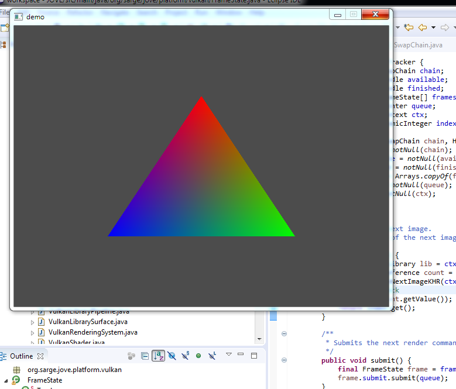

---

## Contents

- [Overview](#overview)
- [Commands](#commands)
- [Integration](#integration)

---

## Overview

We are on the last lap for the goal of this phase of development to render a simple triangle.

The final components required to complete the demo are the command sequence for drawing the triangle and presentation of a rendered frame.

---

## Commands

### Introduction

Vulkan implements work to be performed on a queue by recording a sequence of _commands_ to a _command buffer_ which is allocated and managed by a _command pool_.

For the triangle demo the command sequence is:

1. start the render pass

2. bind the pipeline

3. draw the triangle

4. end the render pass

To specify this chain of commands we would again like to design a fluid API as illustrated by the following pseudo-code:

```java
Command draw = ...

buffer
    .begin()
        .add(pass.begin())
            .add(pipeline.bind())
            .add(draw)
        .add(pass.end());
    .end();
```

The starting point is an outline class for commands, buffers and pools:

```java
@FunctionalInterface
public interface Command {
    /**
     * Records this command to the given buffer.
     * @param lib       Vulkan library
     * @param buffer    Command buffer
     */
    void record(VulkanLibrary lib, Buffer buffer);

    /**
     * A <i>command buffer</i> is allocated by a {@link Pool} and used to record commands.
     */
    class Buffer implements NativeObject {
    }

    /**
     * A <i>command pool</i> allocates and maintains command buffers that are used to perform work on a given {@link Queue}.
     */
    class Pool extends AbstractVulkanObject {
    }
}
```

The `Command` interface abstracts the signature of a Vulkan command where the arguments always comprise the Vulkan API and the command buffer.

A new API is implemented for commands:

```java
interface Library {
    int  vkCreateCommandPool(LogicalDevice device, VkCommandPoolCreateInfo pCreateInfo, Pointer pAllocator, PointerByReference pCommandPool);
    int  vkResetCommandPool(LogicalDevice device, Pool commandPool, BitMask<VkCommandPoolResetFlag> flags);
    void vkDestroyCommandPool(LogicalDevice device, Pool commandPool, Pointer pAllocator);

    int  vkAllocateCommandBuffers(LogicalDevice device, VkCommandBufferAllocateInfo pAllocateInfo, Pointer[] pCommandBuffers);
    int  vkResetCommandBuffer(Buffer commandBuffer, BitMask<VkCommandBufferResetFlag> flags);
    void vkFreeCommandBuffers(LogicalDevice device, Pool commandPool, int commandBufferCount, Buffer[] pCommandBuffers);

    int  vkBeginCommandBuffer(Buffer commandBuffer, VkCommandBufferBeginInfo pBeginInfo);
    int  vkEndCommandBuffer(Buffer commandBuffer);
}
```

### Command Pool

The command pool is tackled first:

```java
class Pool extends AbstractVulkanObject {
    private final WorkQueue queue;

    private Pool(Pointer handle, LogicalDevice dev, WorkQueue queue) {
        super(handle, dev);
        this.queue = notNull(queue);
    }

    @Override
    protected Destructor<Pool> destructor(VulkanLibrary lib) {
        return lib::vkDestroyCommandPool;
    }
}
```

Command pools are created via a factory method:

```java
public static Pool create(LogicalDevice dev, WorkQueue queue, VkCommandPoolCreateFlag... flags) {
    // Init pool descriptor
    var info = new VkCommandPoolCreateInfo();
    info.queueFamilyIndex = queue.family().index();
    info.flags = new BitMask<>(flags);

    // Create pool
    VulkanLibrary lib = dev.library();
    PointerByReference pool = dev.factory().pointer();
    check(lib.vkCreateCommandPool(dev, info, null, pool));

    // Create pool
    return new Pool(pool.getValue(), dev, queue);
}
```

Command buffers can then be allocated from the pool via the following factory method:

```java
public List<Buffer> allocate(int num, VkCommandBufferLevel level) {
    // Init descriptor
    var info = new VkCommandBufferAllocateInfo();
    info.level = notNull(level);
    info.commandBufferCount = oneOrMore(num);
    info.commandPool = this.handle();

    // Allocate buffers
    DeviceContext dev = super.device();
    VulkanLibrary lib = dev.library();
    Pointer[] handles = new Pointer[num];
    check(lib.vkAllocateCommandBuffers(dev, info, handles));
    
    ...
}
```

The handles of the newly allocated buffers are then transformed to the domain object:

```java
return Arrays
    .stream(handles)
    .map(ptr -> new Buffer(ptr, this))
    .toList();
```

Note that command buffers are automatically released by the pool when it is destroyed.

Buffers can also be explicitly released back to the pool by the application:

```java
public void free(Collection<Buffer> buffers) {
    DeviceContext dev = super.device();
    dev.library().vkFreeCommandBuffers(dev, this, buffers.size(), NativeObject.toArray(buffers));
}
```

Finally the pool can also be reset which recycles resources and restores all allocated buffers to their initial state:

```java
public void reset(VkCommandPoolResetFlag... flags) {
    BitMask<VkCommandPoolResetFlag> bits = new BitMask<>(flags);
    DeviceContext dev = super.device();
    check(dev.library().vkResetCommandPool(dev, this, bits));
}
```

### Command Buffers

A command buffer is used to __record__ a sequence of commands which can then be submitted to a work queue for execution:

```java
class Buffer implements NativeObject {
    private enum State {
        INITIAL,
        RECORDING,
        EXECUTABLE,
    }

    private final Handle handle;
    private final Pool pool;
    private State state = State.INITIAL;

    public boolean isReady() {
        return state == State.EXECUTABLE;
    }
}
```

The _state_ member tracks whether the buffer has been recorded or is ready for execution (the enumeration names are based on the Vulkan documentation).

The `begin` method starts the recording of a command sequence:

```java
public Buffer begin(VkCommandBufferUsageFlag... flags) {
    // Check buffer can be recorded
    if(state != State.INITIAL) throw new IllegalStateException();

    // Init descriptor
    var info = new VkCommandBufferBeginInfo();
    info.flags = new BitMask<>(flags);

    // Start buffer recording
    VulkanLibrary lib = pool.device().library();
    check(lib.vkBeginCommandBuffer(this, info));

    // Start recording
    state = State.RECORDING;
    
    return this;
}
```

Commands can then be recorded to the buffer:

```java
public Buffer add(Command cmd) {
    if(state != State.RECORDING) throw new IllegalStateException();
    VulkanLibrary lib = pool.device().library();
    cmd.record(lib, Buffer.this);
    return this;
}
```

And finally the `end` method completes recording and marks the buffer ready for execution:

```java
public Buffer end() {
    if(state != State.RECORDING) throw new IllegalStateException();
    VulkanLibrary lib = pool.device().library();
    check(lib.vkEndCommandBuffer(this));
    state = State.EXECUTABLE;
    return this;
}
```

### Submission

Submitting tasks to a work queue involves populating a Vulkan descriptor for one-or-more command buffers with a synchronisation specification, which is encapsulated into a new class:

```java
public class Work {
    private final Pool pool;
    private final List<Buffer> buffers = new ArrayList<>();
    
    private void populate(VkSubmitInfo info) {
        ...
    }
}
```

Notes:

* Although this object is not necessarily dependant on the command pool it is more convenient to have direct access to the pool (and the logical device).

* In this case we prefer to give the new class a more explicit and meaningful name (rather than `SubmitInfo` for example).

* Synchronisation is deferred until later as it is not needed for the triangle demo.

A work instance is constructed by the obligatory builder which is used to add command buffers to the submission:

```java
public Builder add(Buffer buffer) {
    // Check buffer has been recorded
    if(!buffer.isReady()) throw new IllegalStateException(...);

    // Check all work is submitted to the same queue family
    if(!matches(work, buffer.pool())) throw new IllegalArgumentException(...);

    // Add buffer to this work
    work.buffers.add(buffer);

    return this;
}
```

All command buffers __must__ be submitted to the same queue family which is validated by the `matches` helper:

```java
private static boolean matches(Work work, Pool pool) {
    Family left = work.pool.queue().family();
    Family right = pool.queue().family();
    return left.equals(right);
}
```

Work is submitted to the queue as a _batch_ which again must all use the same queue family:

```java
public static void submit(Collection<Work> batch, Fence fence) {
    // Check batch submits to expected queue
    Pool pool = batch.iterator().next().pool();
    for(Work work : batch) {
        if(!matches(pool, work.pool())) {
            throw new IllegalArgumentException(...);
        }
    }

    // Submit batch
    VkSubmitInfo[] array = StructureCollector.array(batch, new VkSubmitInfo(), Work::populate);
    VulkanLibrary lib = pool.device().library();
    check(lib.vkQueueSubmit(pool.queue(), array.length, array, fence));
}
```

Where the Vulkan descriptor for each work submission in the batch is populated as follows:

```java
private void populate(VkSubmitInfo info) {
    info.commandBufferCount = buffers.size();
    info.pCommandBuffers = NativeObject.toArray(buffers);
    // TODO - synchronisation
}
```

Finally the new API method is added to the device library:

```java
interface Library {
    ...
    int vkQueueSubmit(WorkQueue queue, int submitCount, VkSubmitInfo[] pSubmits, Fence fence);
}
```

---

## Integration

### Commands

The specific commands required for rendering the triangle can now be implemented.

The following factory method is added on the `FrameBuffer` class to begin rendering to that buffer:

```java
public Command begin() {
    // Create descriptor
    var info = new VkRenderPassBeginInfo();
    info.renderPass = pass.handle();
    info.framebuffer = this.handle();

    // Populate rendering area
    VkExtent2D ext = info.renderArea.extent;
    ext.width = extents.width();
    ext.height = extents.height();

    // Init clear values
    ...

    // Create command
    return (lib, buffer) -> lib.vkCmdBeginRenderPass(buffer, info, VkSubpassContents.INLINE);
}
```

For the moment a temporarily bodge is added to clear the attachment to a neutral grey colour:

```java
VkClearValue clear = new VkClearValue();
clear.color = new VkClearColorValue();
clear.color.float32 = new float[]{0.3f, 0.3f, 0.3f, 1};
info.clearValueCount = 1;
info.pClearValues = clear;
```

Clear values will be more fully implemented in the [models](/JOVE/blog/part-4-models/model-loader) chapter.

Ending the render pass is defined as a constant since the command does not require any additional arguments:

```java
public static final Command END = (lib, buffer) -> lib.vkCmdEndRenderPass(buffer);
```

To bind the pipeline in the render sequence a new command factory method is added to the `Pipeline` class:

```java
public Command bind() {
    return (lib, buffer) -> lib.vkCmdBindPipeline(buffer, VkPipelineBindPoint.GRAPHICS, this);
}
```

Finally the draw command is hard-coded to render the triangle vertices:

```java
Command draw = (lib, handle) -> lib.vkCmdDraw(handle, 3, 1, 0, 0);
```

This specifies three triangles vertices, in a single instance, both starting at index zero.  A proper builder for draw commands will be implemented in a later chapter.

The new drawing commands are added to the render pass library:

```java
interface Library {
    ...
    void vkCmdBeginRenderPass(Buffer commandBuffer, VkRenderPassBeginInfo pRenderPassBegin, VkSubpassContents contents);
    void vkCmdEndRenderPass(Buffer commandBuffer);
    void vkCmdDraw(Buffer commandBuffer, int vertexCount, int instanceCount, int firstVertex, int firstInstance);
}
```

### Rendering Sequence

In the demo application the devices configuration class is modified by replacing the two queues with command pools:

```java
class DeviceConfiguration {
    private static Pool pool(LogicalDevice dev, Family family) {
        WorkQueue queue = dev.queue(family);
        return Pool.create(dev, queue);
    }
    
    @Bean
    public Pool graphics(LogicalDevice dev) {
        return pool(dev, graphicsFamily);
    }
    
    @Bean
    public Pool presentation(LogicalDevice dev) {
        return pool(dev, presentationFamily);
    }
}
```

Next a new configuration class is added to construct the rendering sequence based on the pseudo-code above:

```java
@Configuration
public class RenderConfiguration {
    @Bean
    public static Buffer sequence(FrameBuffer frame, Pipeline pipeline, Pool graphics) {
        Command draw = ...
        return graphics
            .allocate()
            .begin()
                .add(frame.begin())
                    .add(pipeline.bind())
                    .add(draw)
                .add(FrameBuffer.END)
            .end();
    }
}
```

Note that the bean for the injected command pool is disambiguated by _name_ (alternatively an explicit `@Qualifier` annotation could have been used).

To finally display the triangle we invoke presentation in a new bean which starts a Spring `ApplicationRunner` once the container has been initialised:

```java
@Bean
public static ApplicationRunner render(Swapchain swapchain, Buffer render) {
    return args -> { ... }
}
```

Although we have a double-buffer swapchain and many of the components required to implement a fully fledged render loop, for the moment we bodge a single frame:

```java
// Start next frame
int index = swapchain.acquire(null, null);

// Render frame
Work.of(render).submit();

// Wait for frame
Pool pool = render.pool();
pool.waitIdle();

// Present frame
swapchain.present(pool.queue(), index, null);

// Wait...
Thread.sleep(1000);
```

A convenience factory is added to the `Work` class to create a submission for a single command buffer:

```java
public static Work of(Buffer buffer) {
    Pool pool = buffer.pool();
    return new Builder(pool).add(buffer).build();
}
```

Notes:

* The presentation methods will generate Vulkan errors since the synchronisation arguments are unspecified.

* Execution is briefly blocked at the end of the 'loop' so we have a chance of seeing the results (assuming there are any).

* Obviously this is temporary code just sufficient to test this first demo, a proper render loop will be addressed in a future chapter.

* The window will be non-functional since the GLFW event queue is not being polled, i.e. cannot be moved or closed.

### Conclusion

If all goes well we should see the following when running the final demo:



Viola!

All that for a triangle?

There are a couple of gotchas that could result in staring at a blank screen:

* The triangle vertices in the vertex shader are ordered counter-clockwise which _should_ be the default winding order.  Although not covered in this part of the demo the _rasterizer_ pipeline stage may need to be configured explicitly and/or culling switched off altogether.

* The arguments for the hard-coded drawing command are all integer values and can easily be accidentally transposed.

---

## Summary

In the final chapter for this phase of development we implemented:

* The command pool and buffer.

* A mechanism for submitting work to the hardware.

* Specific commands to support rendering.

* Support for presentation.

* A crude render 'loop' to display the triangle.

