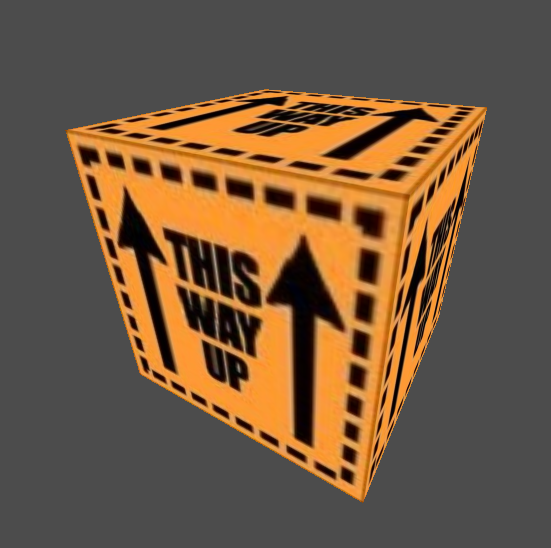
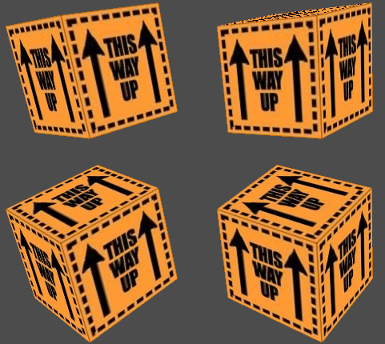

---

## Contents

- [Overview](#overview)
- [View Transformation](#view-transformation)
- [Cube](#cube)
- [Integration](#integration)
- [Instanced Drawing](#instanced-drawing)

---

## Overview

In this chapter we will extend the previous demo to render a rotating, textured cube.

First we introduce the _view transform_ representing the viewers position and orientation and _perspective projection_ so that fragments in the scene appear correctly foreshortened.

This will require the following new components:

* The _matrix_ class.

* The perspective projection matrix.

* And a Vulkan _uniform buffer_ to pass the matrix to the shader.

To render and animate the cube we will also implement:

* A builder for a _mesh_ comprising vertex data.

* A specific builder for a cube.

* A rotation matrix.

* A simple loop to render multiple frames.

Finally multiple _instances_ of the cube will be rendered using various approaches.

---

## View Transformation

### Enter The Matrix

The view transform and perspective projection are both implemented as a 4-by-4 matrix structured as follows:

```
Rx Ry Rz Tx
Yx Yy Yz Ty
Dx Dy Dz Tz
0  0  0  1
```

Where the top-left 3-by-3 segment of the matrix is the rotation component and the right-hand column _T_ is the translation.

In camera terms _R_ is the _right_ axis, _Y_ is _up_ and _D_ is the _direction_ of the view.

We first establish some constraints on our design for the matrix class:

* Must be _square_ (same width and height).

* Arbitrary _order_ (or size).

* Immutable.

The first-cut outline for the matrix is as follows:

```java
public final class Matrix implements Bufferable {
    private final float[][] matrix;

    private Matrix(int order) {
        matrix = new float[order][order];
    }

    public int order() {
        return matrix.length;
    }

    public float get(int row, int col) {
        return matrix[row][col];
    }
}
```

The matrix data is implemented as a 2D floating-point array, this is certainly not the most efficient implementation in terms of memory (since each row is itself an object) but it is the simplest to implement.

A matrix is also a bufferable object:

```java
public void buffer(ByteBuffer buffer) {
    int order = order();
    for(int r = 0; r < order; ++r) {
        for(int c = 0; c < order; ++c) {
            buffer.putFloat(matrix[c][r]);
        }
    }
}
```

Note that the row-column indices are transposed to output the matrix in _column major_ order which is the default expected by Vulkan.

Matrices are constructed by a companion builder:

```java
public static class Builder {
    private float[][] matrix;

    public Builder(int order) {
        matrix = new float[order][order];
    }
    
    public Matrix build() {
        return new Matrix(matrix);
    }
}
```

Matrix elements are populated using the following method:

```java
public Builder set(int row, int col, float value) {
    matrix[row][col] = value;
    return this;
}
```

Which is also used to initialise the _identity_ matrix:

```java
public Builder identity() {
    for(int n = 0; n < matrix.length; ++n) {
        set(n, n, 1);
    }
    return this;
}
```

Further matrix functionality will be added as the chapter progresses.

For further background reading see [OpenGL matrices tutorial](http://www.opengl-tutorial.org/beginners-tutorials/tutorial-3-matrices/)

> Obviously we could have simply employed a third-party matrices library but one of our project goals is to learn from first principles.

### Uniform Buffers

Matrices are passed to a shader via a _uniform buffer_ which is a descriptor set resource implemented as a general Vulkan buffer.

The resource is created using the following new factory method on the `VulkanBuffer` class:

```java
public DescriptorResource uniform() {
    require(VkBufferUsage.UNIFORM_BUFFER);

    return new DescriptorResource() {
        @Override
        public VkDescriptorType type() {
            return VkDescriptorType.UNIFORM_BUFFER;
        }

        @Override
        public VkDescriptorBufferInfo build() {
            var info = new VkDescriptorBufferInfo();
            info.buffer = handle();
            info.offset = offset;
            info.range = length();
            return info;
        }
    };
}
```

As a first step the identity matrix is applied to the quad vertices to test the uniform buffer:

```java
@Configuration
public class CameraConfiguration {
    @Bean
    public static Matrix matrix() {
        return Matrix.IDENTITY;
    }
}
```

The matrix is loaded into a uniform buffer:

```java
@Bean
public static VulkanBuffer uniform(LogicalDevice dev, Allocator allocator, Matrix matrix) {
    var props = new MemoryProperties.Builder<VkBufferUsage>()
        .usage(VkBufferUsage.UNIFORM_BUFFER)
        .required(VkMemoryProperty.HOST_VISIBLE)
        .required(VkMemoryProperty.HOST_COHERENT)
        .optimal(VkMemoryProperty.DEVICE_LOCAL)
        .build();

    VulkanBuffer uniform = VulkanBuffer.create(dev, allocator, matrix.length(), props);
    uniform.load(matrix);

    return uniform;
}
```

Where `load` is a new helper method to make the process of loading data into the buffer slightly more convenient:

```java
public void load(Bufferable data) {
    Region region = mem.region().orElseGet(mem::map);
    ByteBuffer bb = region.buffer();
    data.buffer(bb);
}
```

Note that in this case the buffer is also visible to the host (i.e. the application), which is generally less performant than device-only memory, and usually allocated from a smaller heap.
However this allows the application to update the matrix per frame without the overhead of copying via an intermediate staging buffer.

A second binding is required in the descriptor set layout for the uniform buffer:

```java
private final Binding samplerBinding = ...

private final Binding uniformBinding = new Binding.Builder()
    .binding(1)
    .type(VkDescriptorType.UNIFORM_BUFFER)
    .stage(VkShaderStage.VERTEX)
    .build();
```

The new resource is registered with the descriptor set pool:

```java
public Pool pool() {
    return new Pool.Builder()
        .add(VkDescriptorType.COMBINED_IMAGE_SAMPLER, count)
        .add(VkDescriptorType.UNIFORM_BUFFER, count)
        .max(1)
        .build(dev);
}
```

And finally the uniform buffer resource is initialised in the `descriptors` bean:

```java
DescriptorSet.set(descriptors, uniformBinding, uniform.uniform());
```

To use the uniform buffer in the shader the following layout declaration is added:

```glsl
layout(binding=1) uniform ubo {
    mat4 matrix;
};
```

The matrix is applied to each vertex:

```glsl
gl_Position = matrix * vec4(inPosition, 1.0);
```

Note that a _homogeneous_ vector (consisting of four components) is created to multiply the vertex position by the matrix.

The vertex shader should now look like this:

```glsl
#version 450

layout(binding=1) uniform ubo {
    mat4 matrix;
};

layout(location=0) in vec3 inPosition;
layout(location=1) in vec2 inTexCoord;

layout(location=0) out vec2 outTexCoord;

void main() {
    gl_Position = matrix * vec4(inPosition, 1.0);
    outTexCoord = inTexCoord;
}
```

If all goes well the demo should still render the same flat textured quad since the identity matrix essentially changes nothing.

### View Transform

To construct the view transform the _vector_ domain object is introduced which is the second `Tuple` implementation:

```java
public final class Vector extends Tuple {
    public static final Vector X = new Vector(1, 0, 0);
    public static final Vector Y = new Vector(0, 1, 0);
    public static final Vector Z = new Vector(0, 0, 1);

    ...
    
    public Vector invert() {
        return new Vector(-x, -y, -z);
    }
}
```

The following methods are added to the matrix builder to populate a row or column of the matrix:

```java
public Builder row(int row, Vector vec) {
    set(row, 0, vec.x);
    set(row, 1, vec.y);
    set(row, 2, vec.z);
    return this;
}

public Builder column(int col, Vector vec) {
    set(0, col, vec.x);
    set(1, col, vec.y);
    set(2, col, vec.z);
    return this;
}
```

The view transform matrix is comprised of translation and rotation components multiplied together:

```java
public Matrix multiply(Matrix m) {
    // Check same sized matrices
    int order = order();
    if(m.order() != order) throw new IllegalArgumentException();

    // Multiply matrices
    var result = new float[order][order];
    for(int r = 0; r < order; ++r) {
        for(int c = 0; c < order; ++c) {
            float total = 0;
            for(int n = 0; n < order; ++n) {
                total += this.matrix[r][n] * m.matrix[n][c];
            }
            result.matrix[r][c] = total;
        }
    }

    return new Matrix(result);
}
```

The elements of the resultant matrix are the _sum_ of each _row_ multiplied by the corresponding _column_ in the right-hand matrix.

For example, given the following matrices:

```
[a b]   [c .]
[. .]   [d .]
```

The result for element [0, 0] is `ac + bd` (and similarly for the rest of the matrix).

To test the view transform matrix, in the `matrix` bean the eye position (or camera) is moved one unit to the right (or the scene is moved one unit to the left, whichever way you look at it):

```java
Matrix trans = new Matrix.Builder()
    .identity()
    .column(3, new Point(1, 0, 0))
    .build();
```

The rotation component of the matrix is initialised to the three camera axes:

```java
Matrix rot = new Matrix.Builder()
    .row(0, Vector.X)
    .row(1, Vector.Y.invert())
    .row(2, Vector.Z)
    .build();
```

Finally the two components are multiplied together to compose the view transform matrix:

```java
return rot.multiply(trans);
```

Notes:

* The Y axis is inverted for Vulkan (points _down_ the screen).

* The Z axis points _out_ from the screen.

* The order of the operations is important since matrix multiplication is non-commutative.

* The view-transform will be wrapped into a camera class in a future chapter.

When running the demo the quad should now be rendered to the right of the screen.

### Perspective Projection

A _projection_ matrix is used to apply perspective or orthographic projection to the scene:

```java
public interface Projection {
    /**
     * Builds the matrix for this projection.
     * @param near      Near plane
     * @param far       Far plane
     * @param dim       Viewport dimensions
     * @return Projection matrix
     */
    Matrix matrix(float near, float far, Dimensions dim);
}
```

A _perspective projection_ is based on the field-of-view (FOV) which is analogous to the focus of a camera:

```java
static Projection perspective(float fov) {
    return new Projection() {
        private final float scale = 1 / MathsUtil.tan(fov * MathsUtil.HALF);

        @Override
        public Matrix matrix(float near, float far, Dimensions dim) {
            return new Matrix.Builder()
                .set(0, 0, scale / dim.ratio())
                .set(1, 1, -scale)
                .set(2, 2, far / (near - far))
                .set(2, 3, (near * far) / (near - far))
                .set(3, 2, -1)
                .build();
        }
    };
}
```

Notes:

* This code is based on the example from the Vulkan Cookbook.

* The matrix assumes the Y axis points __down__ the viewport.

* `MathsUtil` is a utility class providing common constants, wrappers for trigonometric functions, and helpers for various mathematical use cases.

A convenience constant is added for a perspective projection with a default field-of-view:

```java
Projection DEFAULT = perspective(MathsUtil.toRadians(60));
```

The perspective projection is composed with the view transform to build the final matrix:

```java
@Configuration
public class CameraConfiguration {
    private Matrix projection;

    public CameraConfiguration(Swapchain swapchain) {
        projection = Projection.DEFAULT.matrix(0.1f, 100, swapchain.extents());
    }

    @Bean
    static Matrix view() {
        return Matrix.IDENTITY;
    }

    @Bean
    public Matrix matrix() {
        ...
        return projection.multiply(view);
    }
}
```

To exercise the perspective projection one edge of the quad is moved into the screen by fiddling the Z coordinate of the right-hand vertices:

```java
new Point(-0.5f, -0.5f, 0)
new Point(-0.5f, +0.5f, 0)
new Point(+0.5f, -0.5f, -0.5f)
new Point(+0.5f, +0.5f, -0.5f)
```

If the transformation code is correct we should now see the quad in 3D with the right-hand edge sloping away from the viewer like an open door:


Note that the translation component of the view transform was reverted back to the centre of the screen.

---

## Cube

### Mesh

The cube will be implemented as a _mesh_ which composes the drawing properties of a renderable object:

```java
public interface Mesh {
    /**
     * @return Drawing primitive
     */
    Primitive primitive();

    /**
     * @return Draw count
     */
    int count();

    /**
     * @return Vertex layout
     */
    CompoundLayout layout();
}
```

Rather than fiddling the code-generated `VkPrimitiveTopology` enumeration a wrapper is implemented for drawing primitives which can then provide additional helpers:

```java
public enum Primitive {
    POINT(1),
    PATCH(1),
    LINE(2),
    LINE_STRIP(2),
    TRIANGLE(3),
    TRIANGLE_STRIP(3),
    TRIANGLE_FAN(3);

    private final int size;
    
    /**
     * @return Whether this primitive is a strip
     */
    public boolean isStrip() {
        return switch(this) {
            case TRIANGLE_STRIP, TRIANGLE_FAN, LINE_STRIP -> true;
            default -> false;
        };
    }
}
```

A mesh is constructed by the following mutable implementation:

```java
public class DefaultMesh extends AbstractMesh {
    private final List<Vertex> vertices = new ArrayList<>();

    public DefaultMesh(Primitive primitive, CompoundLayout layout) {
        super(primitive, layout);
    }

    public DefaultMesh add(Vertex vertex) {
        vertices.add(vertex);
        return this;
    }
}
```

The interleaved vertex buffer is generated from the mutable model in the same manner as the hard-coded quad previously:

```java
public ByteSizedBufferable vertices() {
    return new ByteSizedBufferable() {
        @Override
        public int length() {
            return layout.stride() * vertices.size();
        }

        @Override
        public void buffer(ByteBuffer bb) {
            for(Bufferable b : vertices) {
                b.buffer(bb);
            }
        }
    };
}
```

### Cube Builder

The new mesh implementation is next used to construct the cube:

```java
public class CubeBuilder {
    private float size = MathsUtil.HALF;
    
    public Mesh build() {
        DefaultMesh mesh = new DefaultMesh(Primitive.TRIANGLE, new CompoundLayout(Point.LAYOUT, Coordinate2D.LAYOUT));
        ...
        return mesh;
    }
}
```

The cube vertices are specified as a simple array:

```java
private static final Point[] VERTICES = {
    // Front
    new Point(-1, -1, 1),
    new Point(-1, +1, 1),
    new Point(+1, -1, 1),
    new Point(+1, +1, 1),

    // Back
    new Point(+1, -1, -1),
    new Point(+1, +1, -1),
    new Point(-1, -1, -1),
    new Point(-1, +1, -1),
};
```

Each face of the cube is comprised of a quad indexing into the vertices array:

```java
private static final int[][] FACES = {
    { 0, 1, 2, 3 }, // Front
    { 4, 5, 6, 7 }, // Back
    { 6, 7, 0, 1 }, // Left
    { 2, 3, 4, 5 }, // Right
    { 6, 0, 4, 2 }, // Top
    { 1, 7, 3, 5 }, // Bottom
};
```

A quad is comprised of two triangles specified as follows:

```java
public final class Quad {
    public static final List<Integer> LEFT = List.of(0, 1, 2);
    public static final List<Integer> RIGHT = List.of(2, 1, 3);
    public static final List<Coordinate2D> COORDINATES = List.of(TOP_LEFT, BOTTOM_LEFT, TOP_RIGHT, BOTTOM_RIGHT);
}
```

Note that __both__ triangles have a counter clockwise winding order since the cube will be rendered using the triangle primitive (as opposed to a strip of triangles used so far).

The triangle indices are aggregated into a single concatenated array:

```java
private static final int[] TRIANGLES = Stream
    .of(Quad.LEFT, Quad.RIGHT)
    .flatMap(List::stream)
    .mapToInt(Integer::intValue)
    .toArray();
```

The `build` method iterates over the array of faces to lookup the vertex components for each triangle:

```java
for(int face = 0; face < FACES.length; ++face) {
    for(int corner : TRIANGLES) {
        int index = FACES[face][corner];
        Point pos = VERTICES[index].scale(size);
        Coordinate coord = Quad.COORDINATES.get(corner);
        ...
    }
}
```

Finally each vertex is added to the cube:

```java
Vertex vertex = new DefaultVertex(pos, coord);
model.add(vertex);
```

---

## Integration

### Cube

In the demo the hard-coded quad vertices are replaced by a cube mesh:

```java
public class VertexBufferConfiguration {
    @Bean
    public static Mesh cube() {
        return new CubeBuilder().build();
    }
}
```

The cube is injected into the `vbo` bean and loaded into the staging buffer:

```java
VulkanBuffer staging = VulkanBuffer.staging(dev, allocator, cube.vertices());
```

To configure the drawing primitive the relatively trivial _input assembly pipeline stage_ is implemented:

```java
public class InputAssemblyStageBuilder extends AbstractPipelineBuilder<VkPipelineInputAssemblyStateCreateInfo> {
    private VkPrimitiveTopology topology = VkPrimitiveTopology.TRIANGLE_STRIP;
    private boolean restart;
    
    ...

    @Override
    VkPipelineInputAssemblyStateCreateInfo get() {
        var info = new VkPipelineInputAssemblyStateCreateInfo();
        info.topology = topology;
        info.primitiveRestartEnable = restart;
        return info;
    }
}
```

Which maps the drawing primitive to the corresponding Vulkan topology:

```java
public AssemblyStageBuilder topology(Primitive primitive) {
    this.topology = switch(primitive) {
        case POINT          -> VkPrimitiveTopology.POINT_LIST;
        case LINE           -> VkPrimitiveTopology.LINE_LIST;
        ...
        default -> throw new RuntimeException();
    };
    return this;
}
```


The vertex input and assembly stages are now specified by the cube mesh in the pipeline configuration:

```java
return new Pipeline.Builder()
    ...
    .input()
        .add(cube.layout())
        .build()
    .assembly()
        .topology(cube.primitive())
        .build()
    .build(dev);
```

Finally the draw command is updated in the render sequence:

```java
Command draw = (lib, buffer) -> lib.vkCmdDraw(buffer, mesh.count(), 1, 0, 0);
```

When we run the demo it should look roughly the same since we will be looking at the front face of the cube.

### Rotation

To apply a rotation to the cube the following factory method is implemented on the matrix class:

```java
public static Matrix rotation(Vector axis, float angle) {
    Builder rot = new Builder().identity();
    float sin = MathsUtil.sin(angle);
    float cos = MathsUtil.cos(angle);
    if(Vector.X.equals(axis)) {
        rot.set(1, 1, cos);
        rot.set(1, 2, -sin);
        rot.set(2, 1, sin);
        rot.set(2, 2, cos);
    }
    else
    if(Vector.Y.equals(axis)) {
        ...
    }
    else
    if(Vector.Z.equals(axis)) {
        ...
    }
    else {
        throw new UnsupportedOperationException();
    }
    return rot.build();
}
```

In the camera configuration we compose a temporary, static rotation about the X-Y axis:

```java
float angle = MathsUtil.toRadians(30);
Matrix x = Matrix.rotation(Vector.X, angle);
Matrix y = Matrix.rotation(Vector.Y, angle);
Matrix model = x.multiply(y);
```

Which is multiplied with the projection and view transform to generate the final matrix:

```java
return projection.multiply(view).multiply(model);
```

Again note the order of operations: the rotation is applied to the model, then the view transform, and finally the perspective projection.

We should now be able to see the fully 3D cube:



### Animation

To animate the cube rotation we add a temporary loop to render multiple frames which terminates after a specified period:

```java
long period = 5000;
long start = System.currentTimeMillis();
while(true) {
    long time = System.currentTimeMillis() - start;
    if(time > period) {
        break;
    }
    ...
}
```

The temporary static rotation added previously is replaced by a matrix constructed on every frame.  First a horizontal rotation is animated by interpolating the period onto the unit-circle:

```java
float angle = (time % period) * MathsUtil.TWO_PI / period;
Matrix h = Matrix.rotation(Vector.Y, angle);
```

This is combined with a fixed vertical rotation so that the top and bottom faces of the cube can also be seen:

```java
Matrix v = Matrix.rotation(Vector.X, MathsUtil.toRadians(30));
Matrix model = h.multiply(v);
```

The projection, view and model matrices are then composed and loaded to the uniform buffer:

```java
Matrix m = matrix.multiply(model);
uniform.load(m);
```

In the loop the `Thread.sleep()` bodge is replaced with a second `pool.waitIdle()` call to block until each frame has been rendered.

Finally the presentation configuration is modified to create an array of frame buffers (one per swapchain image) to properly utilise the swapchain functionality.
Note that since the above loop is completely single-threaded a single frame buffer with a hard coded index would probably still work.

Hopefully we can now finally see the goal for this chapter: the proverbial rotating textured cube.

Huzzah!

Note there are a number of problems with this crude render loop that will be addressed in the next chapter:

* The GLFW event queue thread is still blocked.

* The render loop will generate validation errors on every frame since synchronisation has not been configured.

* Warnings will also be generated on application shutdown since the array of frame buffers is not automatically released.

---

## Instanced Drawing

### Instance Index

There are several approaches that can be used to render multiple cube instances.

The simplest uses the built-in `gl_InstanceIndex` variable in the vertex shader to index into a hard-coded array.

First the draw command is modified to render four instances:

```java
Command draw = (lib, buffer) -> lib.vkCmdDraw(buffer, mesh.count(), 4, 0, 0);
```

In the vertex shader each cube instance is arranged as a two-by-two grid:

```glsl
vec2 offset[4] = vec2[](
    vec2(-0.5, -0.5),
    vec2(-0.5, +0.5),
    vec2(+0.5, -0.5),
    vec2(+0.5, +0.5)
);
```

And the resultant vertex position is fiddled for each instance by indexing into the array:

```glsl
void main() {
    gl_Position = matrix * vec4(inPosition, 1);
    gl_Position += vec4(offset[gl_InstanceIndex], 0, 0);
    outTexCoord = inTexCoord;
}
```

Obviously this is a very quick-and-dirty hack just to test instanced rendering (especially since the offsets are applied _after_ perspective projection).

It may be worth increasing the rotation period (or disabling the animation altogether) to verify the results:



### Instanced Vertex Attributes

A second approach is to use _per-instance_ vertex attributes to specify the offsets.

First the array is moved to a new method in the vertex buffer configuration class:

```java
@Bean
static VertexBuffer offsets(LogicalDevice dev, Allocator allocator, Command.Pool graphics) {
    Vector[] offsets = {
        new Vector(-0.5f, -0.5f, 0),
        new Vector(-0.5f, +0.5f, 0),
        new Vector(+0.5f, -0.5f, 0),
        new Vector(+0.5f, +0.5f, 0),
    };
    
    ...
}
```

Which is wrapped as a bufferable object:

```java
ByteSizedBufferable data = new ByteSizedBufferable() {
    @Override
    public int length() {
        return offsets.length * Vector.LAYOUT.stride();
    }

    @Override
    public void buffer(ByteBuffer bb) {
        for(Vector v : offsets) {
            v.buffer(bb);
        }
    }
};
```

And a second VBO is created using the same staged approach as the cube and bound to the pipeline.

In the pipeline configuration for the vertex input stage a second binding is added for the new VBO:

```java
.input()
    .add(cube.layout())
    .binding()
        .index(1)
        .rate(VkVertexInputRate.INSTANCE)
        .stride(Vector.LAYOUT.stride())
        .attribute()
            .location(2)
            .format(FormatBuilder.format(Vector.LAYOUT))
            .build()
        .build()
    .build()
```

Where the `rate` for the offsets vertex attribute is configured as `INSTANCE`, i.e. the data is iterated per-instance rather than per-vertex.

In the vertex shader the new vertex attribute is configured as follows:

```glsl
layout(location=2) in vec3 offset;
```

Note that the `location` of each vertex attribute must be unique within the shader and each VBO, however the source of each attribute is opaque to the shader.
i.e. There is no notion or need for a `binding` parameter in the `layout` specification for a vertex attribute.

Finally the position of each vertex is fiddled by the per-instance offset rather than using the `gl_InstanceIndex` variable index:

```glsl
gl_Position += vec4(offset, 0);
```

The results should be the same as the previous hard-coded shader version.

Note that there is no `VkFormat` for a matrix type (the largest format is four 32-bit floating-point values) so we cannot represent matrices as vertex attributes directly, at least not without the complexity of compression and the possible loss of precision.

### Instanced Data

The final approach uses a separate model matrix for each instance, which is the general approach that will be used later when we address scene graphs.

In the vertex shader the projection and view matrices are separated and an _array_ of model matrices is introduced:

```glsl
layout(set=0, binding=1) uniform Matrices {
    mat4 projection;
    mat4 view;
    mat4[4] model;
};

void main() {
    gl_Position = projection * view * model[gl_InstanceIndex] * vec4(inPosition, 1);
    ...
}
```

The uniform buffer is resized to accommodate six matrices (projection, view and four instances) which are written on each frame:

```java
ByteBuffer bb = uniform.buffer();
projection.buffer(bb);
view.buffer(bb);
```

With a model matrix for each instance comprising the rotation and an offset translation:

```java
for(int n = 0; n < instances; ++n) {
    Matrix trans = Matrix.translation(offset[n]);
    Matrix model = trans.multiply(rot.matrix());
    model.buffer(bb);
}
bb.rewind();
```

Notes:

* The (maximum) size of the model matrix array __must__ be specified in the shader.

* The rotation of each cube instance is applied first and _then_ the translation offset.

* The second VBO and per-instance vertex attribute were removed.

* The model matrices use the same uniform buffer as the projection and view but could have been stored in a different uniform or a storage buffer (which will be used in a later chapter).

* GLSL version 460 supports the `gl_BaseInstance` which is the index of the first instance passed to the draw command.

An alternative approach could be to pass the offset vectors in the uniform buffer and construct a translation matrix in the shader:

```glsl
layout(set=0, binding=1) uniform Matrices {
    mat4 projection;
    mat4 view;
    mat4 model;
    vec3[4] offsets;
};

void main() {
    mat4 trans = mat4(
        vec4(1, 0, 0, 0),
        vec4(0, 1, 0, 0),
        vec4(0, 0, 1, 0),
        vec4(offsets[gl_InstanceIndex], 1)
    );

    gl_Position = projection * view * trans * model * vec4(inPosition, 1);
    ...
}
```

---

## Summary

In this chapter we rendered a 3D rotating textured cube and implementing the following:

* The matrix class

* Perspective projection

* Uniform buffers

* Builders for a vertex mesh and cubes

* An animated rotation matrix

* Instanced rendering

