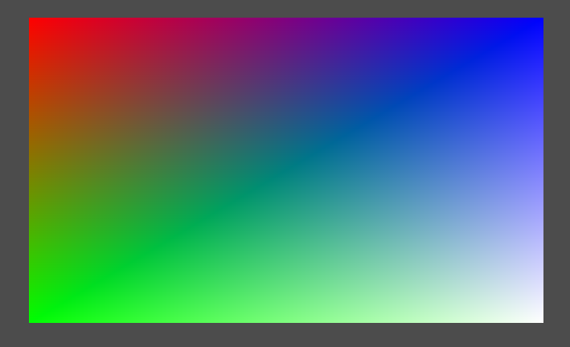
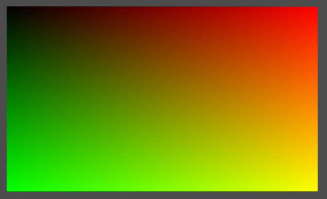

---

## Contents

- [Overview](#overview)
- [Texture Coordinates](#texture-coordinates)
- [Textures](#textures)
- [Integration](#integration)

---

## Overview

In this chapter we will load and apply a _texture_ to the demo.

This involves uploading the image data to the hardware in a similar fashion to the vertex buffers in the previous chapter.  However textures also make use of _pipeline barriers_ to transform the image to the appropriate layout during the loading process.

Unlike the swapchain images the application is responsible for allocating and managing texture images, therefore the existing Vulkan image class will be refactored accordingly.

The following additional components and changes are required:

* A new domain object representing a platform-independant image.

* An associated loader.

* The refactored Vulkan image class.

* A command to copy the image data to the texture.

* Pipeline barriers.

* A texture sampler.

* Texture coordinates.

---

## Texture Coordinates

### Quad

We will first modify the demo to render a quad before moving on to loading and applying the texture.

The vertex data is modified to render a coloured quad with white in the bottom-right corner:

```java
new Vertex(new Point(-0.5f, -0.5f, 0), new Colour(1, 0, 0, 1)),
new Vertex(new Point(-0.5f, +0.5f, 0), new Colour(0, 1, 0, 1)),
new Vertex(new Point(+0.5f, -0.5f, 0), new Colour(0, 0, 1, 1)),
new Vertex(new Point(+0.5f, +0.5f, 0), new Colour(1, 1, 1, 1)),
```

The default drawing primitive is a _triangle strip_ with vertices ordered as follows:

```
0---2---4-- etc
| / | / |
1---3---5
```

The first triangle is comprised of the first three vertices with each subsequent triangle incrementing the 'index' by one resulting in 012, 123, 234, etc.
Therefore a triangle strip has an _alternating_ winding order.

After changing the number of vertices to 4 in the drawing command we should see something like the following:



### Coordinates

Next the texture coordinate domain object is introduced:

```java
public interface Coordinate extends Bufferable {
    record Coordinate1D(float u) implements Coordinate {
        ...
    }

    record Coordinate2D(float u, float v) implements Coordinate {
        @Override
        public final void buffer(ByteBuffer buffer) {
            buffer.putFloat(u).putFloat(v);
        }
    }

    record Coordinate3D(float u, float v, float w) implements Coordinate {
        ...
    }
}
```

For convenience texture coordinates for a quad are provided in the 2D implementation:

```java
public static final Coordinate2D
    TOP_LEFT        = new Coordinate2D(0, 0),
    BOTTOM_LEFT     = new Coordinate2D(0, 1),
    TOP_RIGHT       = new Coordinate2D(1, 0),
    BOTTOM_RIGHT    = new Coordinate2D(1, 1);
```

The colour data in the quad can now be replaced with texture coordinates, as shown here for the top-left vertex:

```java
new Vertex(new Point(-0.5f, -0.5f, 0), Coordinate2D.TOP_LEFT)
```

### Component Layout

As noted in the previous chapter the configuration of the vertex input pipeline stage is currently quite laborious and requires hard-coding the vertex attribute formats.
However the necessary information is already implicit in the vertex components which just needs to be made explicit.

A new type is introduced to represent the data layout of some arbitrary object:

```java
public record Layout(int size, Type type, boolean signed, int bytes) {
    /**
     * Component types.
     */
    public enum Type {
        INTEGER,
        FLOAT,
        NORMALIZED
    }

    public int stride() {
        return size * bytes;
    }
}
```

Where:

* _size_ is the number of components comprising the object, e.g. 3 for a vertex normal.

* _type_ is the numeric type of each component.

* _signed_ specifies whether the data is signed.

* and _bytes_ is the number of bytes per component, e.g. `Float.BYTES`

A convenience factory is added for a floating-point layout:

```java
public static Layout floats(int size) {
    return new Layout(size, Type.FLOAT, true, Float.BYTES);
}
```

Layout constants are added for the existing types and the new texture coordinate class, for example:

```java
record Coordinate2D ... {
    public static final Layout LAYOUT = Layout.floats(2);
}
```

A group of layouts can be aggregated into a _compound layout_ to specify the vertex structure:

```java
public final class CompoundLayout {
    private final List<Layout> layout;
    private final int stride;

    public CompoundLayout(List<Layout> layout) {
        this.layout = List.copyOf(layout);
        this.stride = layout.stream().mapToInt(Layout::stride).sum();
    }
}
```

A helper method can now be implemented in the vertex input pipeline stage builder to configure a binding from the vertex layout:

```java
public VertexInputStageBuilder add(CompoundLayout layout) {
    // Init binding
    var binding = new BindingBuilder();
    int stride = layout.stride();
    binding.stride(stride);
    
    ...

    // Construct binding
    return binding.build();
}
```

A vertex attribute is created for each layout element:

```java
int offset = 0;
for(Layout c : layout.layout()) {
    // Determine component format
    VkFormat format = FormatBuilder.format(c);

    // Add attribute for component
    new AttributeBuilder(binding)
        .format(format)
        .offset(offset)
        .build();

    // Increment offset to the start of the next attribute
    offset += c.length();
}
assert offset == stride;
```

Note that this implementation assumes:

* The _layout_ indices are contiguous starting at index zero.

* Vertex data is interleaved and contiguous.

The format for each vertex attribute is determined from the layout by a new convenience factory method on the `FormatBuilder` helper:

```java
public static VkFormat format(Layout layout) {
    return new FormatBuilder()
        .count(layout.size())
        .bytes(layout.bytes())
        .signed(layout.signed())
        .type(Type.of(layout.type()))
        .build();
}
```

Where the new `Type::of` helper method maps the Java component type to the Vulkan equivalent.

We can now replace the configuration for the vertex data in the pipeline with the following considerably simpler configuration:

```java
.input()
    .add(Point.LAYOUT, Coordinate2D.LAYOUT)
    .build()
```

### Vertex Shader

The final change modifies the vertex shader to replace the colours with texture coordinates passed through to the fragment shader:

```glsl
#version 450

layout(location = 0) in vec3 inPosition;
layout(location = 1) in vec2 inTexCoord;

layout(location = 0) out vec2 outTexCoord;

void main() {
    gl_Position = vec4(inPosition, 1.0);
    outTexCoord = inTexCoord;
}
```

In the fragment shader a red-green colour is faked based on the texture coordinate:

```glsl
#version 450 core

layout(location = 0) in vec2 texCoord;

layout(location = 0) out vec4 outColor;

void main(void) {
    outColor = vec4(texCoord.x, texCoord.y, 0, 1);
}
```

This should render the quad with black in the top-left corner (corresponding to the origin texture coordinate) and yellow in the bottom-right (full red and green):



We can now be fairly confident that the texture coordinates are being handled correctly before we move onto texture sampling.

---

## Textures

### Overview

The process of loading a texture consists of the following steps:

1. Load the native image.

2. Transform the image to a format and structure supported by Vulkan.

3. Copy the image data to a staging buffer.

4. Create a texture on the hardware.

5. Transition the texture so it is ready for the image.

6. Copy the staged image data to the texture.

7. Transition the texture to a layout ready for sampling.

### Image Data

To load image data from the file system we will use the built-in AWT support in the short-term.  We are likely to want to replace this with a more flexible (and frankly better) implementation at some point in the future, e.g. to support a wider choice of image formats or to use the Android platform (where the AWT package is unavailable).

The requirements for images are fairly straight-forward so the following abstraction is introduced rather than using (for example) Java images directly:

```java
public class ImageData {
    private final Dimensions size;
    private final String components;
    private final Layout layout;
    private final byte[] data;
}
```

Notes:

* The _components_ string specifies the image channels, e.g. `BGRA`

* This implementation assumes one byte per colour channel (for the moment).

The AWT helper is used to load the Java image:

```java
public class NativeImageLoader {
    public ImageData load(InputStream in) throws IOException {
        BufferedImage image = ImageIO.read(in);
        if(image == null) throw new IOException(...);
        ...
    }
}
```

Next the Vulkan layout for the image is determined from the type of image (failing if the image is unsupported):

```java
String components = switch(image.getType()) {
    case TYPE_BYTE_GRAY -> "R";
    case TYPE_4BYTE_ABGR, TYPE_BYTE_INDEXED -> "ABGR";
    default -> throw new RuntimeException(...);
};
```

The image data is extracted as a byte array.

```java
DataBufferByte buffer = (DataBufferByte) image.getRaster().getDataBuffer();
byte[] data = buffer.getData();
```

The image properties are next extracted from the Java image:

```java
Dimensions size = new Dimensions(image.getWidth(), image.getHeight());
Layout layout = new Layout(components, Layout.Type.NORMALIZED, false, 1);
```

And finally the image domain object is instantiated:

```java
return new ImageData(size, components, layout, data);
```

This loader is somewhat crude and brute-force, but it does the business for the images we are interested in for the forseeable future.  The following unit-test is added to check the texture images that will be used in the next few chapters:

```java
@DisplayName("Should load supported image formats")
@ParameterizedTest
@CsvSource({
    "duke.jpg, 5",
    "duke.png, 13",
    "chalet.jpg, 5"
    "heightmap.jpg, 10",
})
void map(String filename, int type) throws IOException {
    Path path = Paths.get("./src/test/resources", filename);
    BufferedImage image = loader.load(Files.newInputStream(path));
    assertNotNull(image);
    assertEquals(type, image.getType());
}
```

### Texture Image

To allow the demo to create Vulkan images programatically the existing class is refactored to an interface:

```java
public interface Image extends NativeObject {
    /**
     * @return Descriptor for this image
     */
    Descriptor descriptor();
}
```

The swapchain builder is refactored to instantiate a new local implementation:

```java
private static class SwapChainImage implements Image {
    private final Handle handle;
    private final LogicalDevice dev;
    private final Descriptor descriptor;
}
```

A second implementation can now be created for general images:

```java
class DefaultImage extends AbstractVulkanObject implements Image {
    private final Descriptor descriptor;
    private final DeviceMemory mem;

    @Override
    protected Destructor<DefaultImage> destructor(VulkanLibrary lib) {
        return lib::vkDestroyImage;
    }

    @Override
    protected void release() {
        if(!mem.isDestroyed()) {
            mem.destroy();
        }
    }
}
```

An image is configured and instantiated as normal via a builder:

```java
class Builder {
    private Descriptor descriptor;
    private MemoryProperties<VkImageUsage> props;
    private VkSampleCountFlag samples = VkSampleCountFlag.COUNT_1;
    private VkImageTiling tiling = VkImageTiling.OPTIMAL;
    private VkImageLayout layout = VkImageLayout.UNDEFINED;
}
```

First the Vulkan descriptor for the image is populated from the various image properties:

```java
public DefaultImage build(LogicalDevice dev, AllocationService allocator) {
    var info = new VkImageCreateInfo();
    info.imageType = descriptor.type();
    info.format = descriptor.format();
    info.extent = descriptor.extents().toExtent3D();
    info.mipLevels = descriptor.levels();
    info.arrayLayers = descriptor.layers();
    info.samples = samples;
    info.tiling = tiling;
    info.initialLayout = layout;
    info.usage = new BitMask<>(props.usage());
    info.sharingMode = props.mode();
    ...
}
```

Next the API is invoked to create the image:

```java
VulkanLibrary lib = dev.library();
PointerByReference handle = dev.factory().pointer();
check(lib.vkCreateImage(dev, info, null, handle));
```

Allocating and binding the image memory follows the same pattern as the vertex buffer in the previous chapter:

```java
// Retrieve image memory requirements
var reqs = new VkMemoryRequirements();
lib.vkGetImageMemoryRequirements(dev, handle.getValue(), reqs);

// Allocate image memory
DeviceMemory mem = allocator.allocate(reqs, props);

// Bind memory to image
check(lib.vkBindImageMemory(dev, handle.getValue(), mem, 0));
```

And finally the domain object is created wrapping the image:

```java
return new DefaultImage(handle.getValue(), dev, descriptor, mem);
```

A new API is created for images:

```java
interface Library {
    int  vkCreateImage(LogicalDevice device, VkImageCreateInfo pCreateInfo, Pointer pAllocator, PointerByReference pImage);
    void vkDestroyImage(DeviceContext device, Image image, Pointer pAllocator);
    void vkGetImageMemoryRequirements(LogicalDevice device, Pointer image, VkMemoryRequirements pMemoryRequirements);
    int  vkBindImageMemory(LogicalDevice device, Pointer image, DeviceMemory memory, long memoryOffset);
}
```

### Image Sub-Resource

The copy command and pipeline barrier are dependant on the image _sub-resource_ which were glossed over in the previous chapter.

A sub-resource is a subset of the aspects, MIP levels and array layers of an image:

```java
public interface SubResource {
    Set<VkImageAspect> aspects();
    int mipLevel();
    int levelCount();
    int baseArrayLayer();
    int layerCount();
}
```

We note that the existing image descriptor is essentially a sub-resource with default values for the MIP level and array layer, therefore this type is refactored accordingly:

```java
public record Descriptor(...) implements SubResource {
    @Override
    public int mipLevel() {
        return 0;
    }

    @Override
    public int baseArrayLayer() {
        return 0;
    }
}
```

The sub-resource can now be initialised to the image descriptor in the various use-cases (image copy, barriers) or a builder can be used to configure a custom sub-resource:

```java
public static class Builder {
    private final Descriptor descriptor;
    private Set<VkImageAspect> aspects = new HashSet<>();
    private int mipLevel;
    private int levelCount;
    private int baseArrayLayer;
    private int layerCount;
}
```

The various setters validate that the sub-resource is a subset of the parent image, for example:

```java
public Builder levelCount(int levelCount) {
    if(levelCount > descriptor.levels()) throw new IllegalArgumentException(...);
    this.levelCount = oneOrMore(levelCount);
    return this;
}
```

Finally the build method initialises the aspect mask to the parent image if not explicitly specified:

```java
public SubResource build() {
    // Init image aspects if not explicitly specified
    if(aspects.isEmpty()) {
        aspects = descriptor.aspects();
    }

    // Private implementation
    record DefaultSubResource(...) {
    }

    // Create sub-resource
    return new DefaultSubResource(aspects, mipLevel, levelCount, baseArrayLayer, layerCount);
}
```

A slight irritation that only came to light during this chapter is that there are two slightly different Vulkan descriptors for sub-resources even though the fields are almost identical.  New factory methods are implemented to transform a sub-resource to either (spot the difference):

```java
default VkImageSubresourceRange toRange() {
    var range = new VkImageSubresourceRange();
    range.aspectMask = new BitMask<>(aspects());
    range.baseMipLevel = mipLevel();
    range.levelCount = levelCount();
    range.baseArrayLayer = baseArrayLayer();
    range.layerCount = layerCount();
    return range;
}

default VkImageSubresourceLayers toLayers() {
    var layers = new VkImageSubresourceLayers();
    layers.aspectMask = new BitMask<>(aspects());
    layers.mipLevel = mipLevel();
    layers.baseArrayLayer = baseArrayLayer();
    layers.layerCount = layerCount();
    return layers;
}
```

### Image Copying

The process of copying the image data from the staging buffer to the texture is a command:

```java
public class ImageTransferCommand implements Command {
    private final Image image;
    private final VulkanBuffer buffer;
    private final VkBufferImageCopy[] regions;
    private final VkImageLayout layout;

    @Override
    public void execute(VulkanLibrary lib, Command.Buffer cb) {
        lib.vkCmdCopyBufferToImage(cb, buffer, image, layout, regions.length, regions);
    }
}
```

Which is constructed by a builder:

```java
public static class Builder {
    private VulkanBuffer buffer;
    private Image image;
    private VkImageLayout layout;
    private final List<CopyRegion> regions = new ArrayList<>();
}
```

A copy command is comprised of a number of _copy regions_ which are specified by a new type:

```java
public record CopyRegion(long offset, int length, int height, SubResource res, VkOffset3D imageOffset, Extents extents)
```

The descriptor for each copy region is populated as follows:

```java
private void populate(VkBufferImageCopy copy) {
    copy.bufferOffset = offset;
    copy.bufferRowLength = length;
    copy.bufferImageHeight = height;
    copy.imageSubresource = SubResource.toLayers(res);
    copy.imageOffset = imageOffset;
    copy.imageExtent = extents.toExtent();
}
```

Where the `toExtent` helper constructs a `VkExtent3D` for the image.

The builder for the copy command generates the array of copy region descriptors:

```java
public ImageTransferCommand build() {
    VkBufferImageCopy[] array = StructureCollector.array(regions, new VkBufferImageCopy(), CopyRegion::populate);
    return new ImageTransferCommand(image, buffer, array, layout);
}
```

The command can also be inverted to copy _from_ the image to a buffer:

```java
public Command invert() {
    buffer.require(VkBufferUsage.TRANSFER_DST);
    return (lib, cmd) -> lib.vkCmdCopyImageToBuffer(cmd, image, layout, buffer, regions.length, regions);
}
```

### Texture Sampler

A _texture sampler_ is used by a shader to sample a colour from the texture:

```java
public class Sampler extends AbstractVulkanObject {
    @Override
    protected Destructor<Sampler> destructor(VulkanLibrary lib) {
        return lib::vkDestroySampler;
    }
}
```

A sampler is configured via a builder which is essentially a wrapper for the underlying Vulkan structure:

```java
public static class Builder {
    public static final float VK_LOD_CLAMP_NONE = 1000;

    private final VkSamplerCreateInfo info = new VkSamplerCreateInfo();

    public Builder() {
        min(VkFilter.LINEAR);
        mag(VkFilter.LINEAR);
        mipmap(VkSamplerMipmapMode.LINEAR);
        maxLod(VK_LOD_CLAMP_NONE);
        anisotropy(1);
        compare(VkCompareOp.NEVER);
        wrap(VkSamplerAddressMode.REPEAT);
    }
}
```

The `wrap` method is a helper that configures the _address mode_ in any of the three axes of a texture by component _index_ rather than the specific field:

```java
public Builder wrap(int component, VkSamplerAddressMode mode) {
    switch(component) {
        case 0 -> info.addressModeU = mode;
        case 1 -> info.addressModeV = mode;
        case 2 -> info.addressModeW = mode;
        default -> throw new IndexOutOfBoundsException(...);
    }
    return this;
}
```

A convenience enumeration is also provided that somewhat simplifies selecting an addressing mode:

```java
public enum AddressMode {
    REPEAT(VkSamplerAddressMode.REPEAT, VkSamplerAddressMode.MIRRORED_REPEAT),
    EDGE(VkSamplerAddressMode.CLAMP_TO_EDGE, VkSamplerAddressMode.MIRROR_CLAMP_TO_EDGE),
    BORDER(VkSamplerAddressMode.CLAMP_TO_BORDER, null);

    private final VkSamplerAddressMode mode, mirrored;

    private AddressMode(VkSamplerAddressMode mode, VkSamplerAddressMode mirrored) {
        this.mode = notNull(mode);
        this.mirrored = mirrored;
    }

    public VkSamplerAddressMode mode() {
        return mode;
    }

    public VkSamplerAddressMode mirror() {
        if(mirrored == null) throw new IllegalStateException();
        return mirrored;
    }
}
```

Construction of the sampler follows the usual pattern:

```java
public Sampler build(LogicalDevice dev) {
    VulkanLibrary lib = dev.library();
    PointerByReference handle = dev.factory().pointer();
    check(lib.vkCreateSampler(dev, info, null, handle));
    return new Sampler(handle.getValue(), dev);
}
```

The API methods for managing sampler are added to the image library:

```java
interface Library {
    int  vkCreateSampler(LogicalDevice device, VkSamplerCreateInfo pCreateInfo, Pointer pAllocator, PointerByReference pSampler);
    void vkDestroySampler(DeviceContext device, Sampler sampler, Pointer pAllocator);
}
```

### Pipeline Barrier

A _pipeline barrier_ is a command used to synchronise access to images, buffers and memory objects within the pipeline:

```java
public class Barrier implements Command {
    private final BitMask<VkPipelineStage> src, dest;
    private final VkImageMemoryBarrier[] images;

    private Barrier(Set<VkPipelineStage> src, Set<VkPipelineStage> dest, VkImageMemoryBarrier[] images) {
        this.src = new BitMask<>(src);
        this.dest = new BitMask<>(dest);
        this.images = notNull(images);
    }

    @Override
    public void execute(VulkanLibrary lib, Buffer buffer) {
        lib.vkCmdPipelineBarrier(buffer, src, dest, 0, 0, null, 0, null, images.length, images);
    }
}
```

Notes:

* The _src_ and _dest_ members specify at what stage(s) in the pipeline the transition should occur.

* The demo only requires a partial implementation to support image transitions.

A barrier is configured and created via a builder:

```java
public static class Builder {
    private final Set<VkPipelineStage> srcStages = new HashSet<>();
    private final Set<VkPipelineStage> destStages = new HashSet<>();
    private final List<ImageBarrierBuilder> images = new ArrayList<>();

    public Barrier build() {
        var array = StructureCollector.array(images, new VkImageMemoryBarrier(), ImageBarrierBuilder::populate);
        return new Barrier(srcStages, destStages, array);
    }
}
```

The image memory part of the barrier is configured by a nested builder:

```java
public class ImageBarrierBuilder {
    private final Image image;
    private final Set<VkAccess> src = new HashSet<>();
    private final Set<VkAccess> dest = new HashSet<>();
    private VkImageLayout oldLayout = VkImageLayout.UNDEFINED;
    private VkImageLayout newLayout;
    private SubResource subresource;
}
```

The Vulkan descriptor for the barrier is populated as follows:

```java
private void populate(VkImageMemoryBarrier barrier) {
    barrier.image = image.handle();
    barrier.srcAccessMask = new BitMask<>(src);
    barrier.dstAccessMask = new BitMask<>(dest);
    barrier.oldLayout = oldLayout;
    barrier.newLayout = newLayout;
    barrier.subresourceRange = SubResource.toRange(subresource);
}
```

### Component Mapping

The last piece of functionality needed for the texture is some means of determining the _component mapping_ for an image when creating the texture view.

Java images have channels in `ABGR` order whereas Vulkan textures are generally `RGBA`, the component mapping allows the image view to _swizzle_ the channels as required.

A new utility class constructs the appropriate component mapping from the _components_ property of the image:

```java
public final class ComponentMapping {
    private static final int SIZE = 4;

    public static VkComponentMapping of(String mapping) {
        var swizzle = new VkComponentSwizzle[SIZE];
        for(int n = 0; n < len; ++n) {
            swizzle[n] = swizzle(mapping.charAt(n));
        }
        return build(swizzle);
    }
}    
```

The `swizzle` method maps a channel character to the corresponding enumeration constant:

```java
private static VkComponentSwizzle swizzle(char mapping) {
    return switch(mapping) {
        case 'R' -> VkComponentSwizzle.R;
        case 'G' -> VkComponentSwizzle.G;
        case 'B' -> VkComponentSwizzle.B;
        case 'A' -> VkComponentSwizzle.A;
        case '=' -> VkComponentSwizzle.IDENTITY;
        case '1' -> VkComponentSwizzle.ONE;
        case '0' -> VkComponentSwizzle.ZERO;
        default -> throw new IllegalArgumentException(...);
    };
}
```

The resultant component mapping descriptor is constructed from the array as follows:

```java
public VkComponentMapping build() {
    var components = new VkComponentMapping();
    components.r = swizzle[0];
    components.g = swizzle[1];
    components.b = swizzle[2];
    components.a = swizzle[3];
    return components;
}
```

Finally the identity component mapping is refactored accordingly:

```java
public static VkComponentMapping identity() {
    var swizzle = new VkComponentSwizzle[SIZE];
    Arrays.fill(swizzle, VkComponentSwizzle.IDENTITY);
    return build(swizzle);
}
```

Note that a new instance is constructed on invocation since JNA structures are mutable.

---

## Integration

We now have all the components required to load an image to the hardware and create the texture sampler.

The texture is loaded by a new configuration class:

```java
@Configuration
public class TextureConfiguration {
    @Autowired private LogicalDevice dev;

    @Bean
    public View texture(Allocator allocator, Pool graphics) throws IOException {
        ...
    }

    @Bean
    public Sampler sampler() {
        return new Sampler.Builder().build(dev);
    }
}
```

In the `texture` bean the image is loaded from the file-system:

```java
ImageData.Loader loader = new NativeImageLoader();
ImageData image = loader.load(new FileInputStream("./src/main/resources/thiswayup.jpg"));
```

From which the appropriate Vulkan format can be determined:

```java
VkFormat format = FormatBuilder.format(image.layout());
```

The image is a `TYPE_4BYTE_ABGR` Java image which corresponds to the `R8G8B8A8_UNORM` Vulkan format.

Next the texture is configured starting with the image descriptor:

```java
Descriptor descriptor = new Descriptor.Builder()
    .type(VkImageType.TWO_D)
    .aspect(VkImageAspect.COLOR)
    .extents(image.extents())
    .format(format)
    .build();
```

The memory properties specify a texture on the hardware that can be written to and sampled from:

```java
var props = new MemoryProperties.Builder<VkImageUsage>()
    .usage(VkImageUsage.TRANSFER_DST)
    .usage(VkImageUsage.SAMPLED)
    .required(VkMemoryProperty.DEVICE_LOCAL)
    .build();
```

Finally the texture image is instantiated:

```java
Image texture = new Image.Builder()
    .descriptor(descriptor)
    .properties(props)
    .build(dev, allocator);
```

The new texture is prepared for writing by an image barrier transition:

```java
new Barrier.Builder()
    .source(VkPipelineStage.TOP_OF_PIPE)
    .destination(VkPipelineStage.TRANSFER)
    .barrier(texture)
        .newLayout(VkImageLayout.TRANSFER_DST_OPTIMAL)
        .destination(VkAccess.TRANSFER_WRITE)
        .build()
    .build()
    .submit(graphics);
```

The image data is transferred to a staging buffer:

```java
VulkanBuffer staging = VulkanBuffer.staging(dev, allocator, image.data());
```

And then copied to the texture:

```java
new ImageCopyCommand.Builder()
    .image(texture)
    .buffer(staging)
    .layout(VkImageLayout.TRANSFER_DST_OPTIMAL)
    .region(CopyRegion.of(descriptor))
    .build()
    .submit(graphics);
```

Which is then transitioned again ready for use by the sampler:

```java
new Barrier.Builder()
    .source(VkPipelineStage.TRANSFER)
    .destination(VkPipelineStage.FRAGMENT_SHADER)
    .barrier(texture)
        .oldLayout(VkImageLayout.TRANSFER_DST_OPTIMAL)
        .newLayout(VkImageLayout.SHADER_READ_ONLY_OPTIMAL)
        .source(VkAccess.TRANSFER_WRITE)
        .destination(VkAccess.SHADER_READ)
        .build()
    .build()
    .submit(graphics);
```

The component mapping for the texture is determined from the image by the new helper:

```java
VkComponentMapping mapping = ComponentMapping.of(image.components());
```

This swizzles the `ABGR` channels of the native image to the `RGBA` default expected by Vulkan.

Finally an image view is created for the texture:

```java
return new View.Builder(texture)
    .mapping(mapping)
    .build();
```

---

## Summary

In this chapter we:

* Introduced texture coordinates.

* Created a basic image loader.

* Added support for texture images and samplers.

* Partially implemented pipeline barriers.

