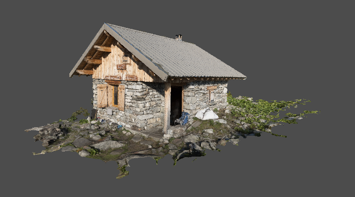

---

## Contents

- [Overview](#overview)
- [Camera](#camera)
- [Depth Buffer](#depth-buffer)
- [Swapchain Recreation](#swapchain-recreation)
- [Improvements](#improvements)

---

## Overview

In this chapter we will render the chalet model constructed previously and resolve various visual problems that arise.

Since we are now dealing with a model that has a specific orientation, the current view-transform matrix will be encapsulated into a new _camera_ model that allows the application to more easily configure the view.  This will be extended in the next chapter to allow the camera to be dynamically controlled by the keyboard and mouse.

First we introduce enhancements to the existing geometry classes to more explicitly support normals and the cardinal axes.

Finally we will address swapchain recreation and also implement various improvements to simplify configuration of the presentation process.

---

## Framework

### Normals Redux

Currently the application code is responsible for ensuring that vectors have been normalised as appropriate.  This either requires the overhead of checking whether a vector has already been normalised (albeit a relatively trivial test) or relying on documentation hints, neither of which are rigorous or explicit.

A better approach is to _enforce_ this requirement at compile-time, therefore the `Vector` class is extended by the introduction of specialisations for normals and the cardinal axes.

A _normal_ is a unit-vector:

```java
public class Normal extends Vector implements Component {
    public static final Layout LAYOUT = Layout.floats(3);

    public Normal(Vector vec) {
        super(normalize(vec));
    }

    @Override
    public final float magnitude() {
        return 1;
    }

    @Override
    public Normal invert() {
        return new Normal(super.invert());
    }

    @Override
    public final Normal normalize() {
        return this;
    }
}
```

This new type is further specialised for the cardinal axes:

```java
public final class Axis extends Normal {
    public static final Axis
        X = new Axis(0),
        Y = new Axis(1),
        Z = new Axis(2);
}
```

The vector of each axis is initialised in the constructor:

```java
private final int index;

private Axis(int index) {
    super(axis(index));
    this.index = index;
}

private static Vector axis(int index) {
    float[] axis = new float[SIZE];
    axis[index] = 1;
    return new Vector(axis);
}
```

The frequently used inverse axes are also pre-calculated and cached:

```java
private final Normal inv = super.invert();

@Override
public Normal invert() {
    return inv;
}
```

And finally the code to construct a rotation matrix about one of the cardinal axes is moved from the matrix class:

```java
public Matrix rotation(float angle) {
    var matrix = new Matrix.Builder().identity();
    float sin = MathsUtil.sin(angle);
    float cos = MathsUtil.cos(angle);
    switch(index) {
        case 0 -> matrix.set(...);
        ...
    }
    return matrix.build();
}
```

Note that this code switches on the `index` of the axis, this works fine for now but may be replaced later by an internal enumeration.

The purpose of these changes are:

1. The intent of code using the new types is now more expressive and type-safe, e.g. classes that _require_ a unit-vector can now enforce the `Normal` type explicitly.

2. Reduces the reliance on documented assumptions and defensive checks to ensure vectors are normalised as required, e.g. when generating rotation matrices.

3. The overhead of re-normalising is trivial where an already normalized vector is referenced as the base `Vector` type.

4. The hierarchy now supports extension points for further optimisations, e.g. caching of the inverse cardinal axes.

The implementation of the `matrix` method for a quaternion is less performant than the code for the cardinal axes.  For an immutable, one-off rotation this probably would not be a concern, but for frequently recalculated rotations about the cardinal axes the faster solution is preferable.  Therefore the axis-angle class selects the most appropriate algorithm:

```java
public class AxisAngle implements Rotation {
    private final Normal axis;
    private final float angle;

    public Matrix matrix() {
        if(axis instanceof Axis cardinal) {
            return cardinal.rotation(angle);
        }
        else {
            return Quaternion.of(this).matrix();
        }
    }
}
```

Note that this implementation also now enforces the axis to be a unit-vector, the results for an arbitrary vector would be interesting!

### Camera

The camera is a model class representing the position and orientation of the viewer:

```java
public class Camera {
    private Point pos = Point.ORIGIN;
    private Normal dir = Axis.Z;
    private Normal up = Axis.Y;
}
```

Note that under the hood the camera direction is the inverse of the view direction, i.e. the camera points _out_ of the screen whereas the view is obviously into the screen.

Various mutators are provided to move the camera:

```java
public void move(Point pos) {
    this.pos = notNull(pos);
}

public void move(Vector vec) {
    pos = pos.add(vec);
}

public void move(float dist) {
    move(dir.multiply(dist));
}
```

And a convenience method points the camera at a given target:

```java
public void look(Point pt) {
    if(pos.equals(pt)) throw new IllegalArgumentException();
    Vector look = Axis.between(pt, pos);
    direction(new Normal(look));
}
```

Where `between` is a new factory method on the vector class:

```java
public static Vector between(Point start, Point end) {
    float dx = end.x - start.x;
    float dy = end.y - start.y;
    float dz = end.z - start.z;
    return new Vector(dx, dy, dz);
}
```

Note that this camera model is subject to gimbal locking, e.g. if the direction is set to the _up_ axis.  Validation is added (not shown) to the relevant setters to prevent this occurring.  Later on we will replace the _direction_ property with a more advanced implementation for the camera orientation to mitigate this problem.

Next the following transient members are added to the camera class to support the view transform:

```java
public class Camera {
    ...
    private Vector right = Axis.X;
    private Matrix matrix;
    private boolean dirty = true;
}
```

Where:

* The `dirty` flag is signalled in the various mutator methods (not shown) when any of the camera properties are modified.

* The `right` vector is the horizontal axis of the camera viewport (also used in the `strafe` method).

The view transform for the camera is constructed on demand:

```java
public Matrix matrix() {
    if(dirty) {
        update();
        dirty = false;
    }
    return matrix;
}
```

The `update` method first determines the viewport axes based on the camera axes:

```java
private void update() {
    // Determine right axis
    right = up.cross(dir).normalize();

    // Determine up axis
    Vector y = dir.cross(right).normalize();
}
```

Where the _cross product_ yields the vector perpendicular to two other vectors (using the right-hand rule):

```java
public Vector cross(Vector vec) {
    float x = this.y * vec.z - this.z * vec.y;
    float y = this.z * vec.x - this.x * vec.z;
    float z = this.x * vec.y - this.y * vec.x;
    return new Vector(x, y, z);
}
```

And finally the matrix is constructed from the translation and rotation components as before:

```java
// Build translation component
Matrix trans = Matrix.translation(new Vector(pos).invert());

// Build rotation component
Matrix rot = new Matrix.Builder()
    .identity()
    .row(0, right)
    .row(1, y)
    .row(2, dir)
    .build();

// Create camera matrix
matrix = rot.multiply(trans);
```

### Draw Command

The draw command will need to be updated for the indexed chalet model, we take the opportunity to implement a convenience builder on the `DrawCommand` class:

```java
public static class Builder {
    private boolean indexed;
    private int count;
    private int firstVertex;
    private int firstIndex;
    private int instanceCount = 1;
    private int firstInstance;
}
```

The build method selects the appropriate command variant depending on the supplied arguments:

```java
public DrawCommand build() {
    if(indexed) {
        return (lib, buffer) -> lib.vkCmdDrawIndexed(buffer, count, instanceCount, firstIndex, firstVertex, firstInstance);
    }
    else {
        return (lib, buffer) -> lib.vkCmdDraw(buffer, count, instanceCount, firstVertex, firstInstance);
    }
}
```

Convenience factory methods are added for common use-cases:

```java
static DrawCommand draw(int count) {
    return new Builder().count(count).build();
}

static DrawCommand indexed(int count) {
    return new Builder().indexed().count(count).build();
}
```

Finally a further helper is implemented to create a draw command for a given mesh:

```java
static DrawCommand of(Mesh mesh) {
    int count = mesh.count();
    if(mesh instanceof IndexedMesh) {
        return indexed(count);
    }
    else {
        return draw(count);
    }
}
```

The hard-coded draw command can now be replaced in the render sequence:

```java
Command draw = DrawCommand.of(mesh);
```

---

## Depth Buffer

### Integration #1

A new `ModelDemo` project is started based on the previous rotating cube demo, minus the rotation animation.

The existing view-transform code is replaced with a camera:

```java
public class CameraConfiguration {
    @Bean
    public static Camera camera() {
        Camera cam = new Camera();
        cam.move(new Point(0, -0.5f, -2));
        return cam;
    }
}
```

And the matrix bean is refactored accordingly:

```java
return projection.multiply(cam.matrix()).multiply(mesh);
```

The previous VBO configuration is replaced with a new class that loads the persisted mesh:

```java
@Configuration
public class ModelConfiguration {
    @Autowired private LogicalDevice dev;
    @Autowired private Allocator allocator;
    @Autowired private Pool graphics;

    @Bean
    public static Mesh model(DataSource src) {
        var loader = new ResourceLoaderAdapter<>(src, new MeshLoader());
        return loader.load("chalet.model");
    }
}
```

Then the VBO and index buffer objects are created for the mesh:

```java
@Bean
public VertexBuffer vbo(Mesh mesh) {
    VulkanBuffer buffer = buffer(mesh.vertices(), VkBufferUsage.VERTEX_BUFFER);
    return new VertexBuffer(buffer);
}

@Bean
public IndexBuffer index(Mesh mesh) {
    VulkanBuffer buffer = buffer(mesh.index().get(), VkBufferUsage.INDEX_BUFFER);
    return new IndexBuffer(buffer, VkIndexType.UINT32);
}
```

Which both delegate to the following helper:

```java
private VulkanBuffer buffer(ByteSizedBufferable data, VkBufferUsage usage) {
    // Create staging buffer
    VulkanBuffer staging = VulkanBuffer.staging(dev, allocator, data);

    // Init buffer memory properties
    var props = new MemoryProperties.Builder<VkBufferUsage>()
        .usage(VkBufferUsage.TRANSFER_DST)
        .usage(usage)
        .required(VkMemoryProperty.DEVICE_LOCAL)
        .build();

    // Create buffer
    VulkanBuffer buffer = VulkanBuffer.create(dev, allocator, staging.length(), props);

    // Copy staging to buffer
    staging.copy(buffer).submit(graphics);

    // Release staging
    staging.destroy();

    return buffer;
}
```

And the index is bound in the render configuration:

```java
@Bean("index.bind")
static Command index(IndexBuffer index) {
    return index.bind(0);
}
```

Finally the `update` method is refactored as follows:

```java
@Bean
public FrameListener update(ResourceBuffer uniform) {
    return frame -> {
        Matrix tilt = new AxisAngle(Axis.X, MathsUtil.toRadians(-90)).matrix();
        Matrix rot = new AxisAngle(Axis.Y, MathsUtil.toRadians(120)).matrix();
        Matrix model = rot.multiply(tilt);
        Matrix matrix = projection.multiply(cam.matrix()).multiply(model);
        matrix.buffer(uniform.buffer());
    };
}
```

The default camera configuration means we are looking at the model from above, therefore the `model` component of the matrix is introduced where:

* The _tilt_ sets the orientation of the model so we are looking at it from the side.

* And _rot_ rotates vertically so the camera is facing the corner of the chalet with the door.

* Note that the camera was also moved slightly above 'ground' level.

When we run the demo the results are a bit of a mess:


There are a couple of issues here but the most obvious is that the texture appears to be upside down, the grass is obviously on the roof and vice-versa.

### Texture Coordinate Invert

The upside-down texture is due to the fact that OBJ texture coordinates (and OpenGL) assume an origin at the bottom-left of the image, whereas for Vulkan the 'start' of the texture image is the top-left corner.

We _could_ fiddle the texture coordinates in the shader, or flip the texture using an editor application, or invert it programatically at load time.  However none of these resolve the actual root problem, flipping the image would just add extra effort, and inverting at runtime would only make loading slower.  Instead the vertical texture coordinate is flipped _once_ when the OBJ model is first loaded.

The following adapter method flips the vertical component of each texture coordinate:

```java
private static Coordinate2D flip(float[] array) {
    assert array.length == 2;
    return new Coordinate2D(array[0], -array[1]);
}
```

And the parser in the OBJ loader is updated accordingly:

```java
add("vt", new VertexComponentParser<>(2, ObjectModelLoader::flip, model.coordinates()));
```

We assume that this will apply to all OBJ models, it can always be made an optional feature if that assumption turns out to be incorrect.

After regenerating the model it now looks to be textured correctly, in particular the signs on the front of the chalet are the right way round (so the model is not being rendered inside-out for example):


### Depth Test

The second problem is that fragments are being rendered arbitrarily overlapping, either the geometry needs to be ordered by distance from the camera, or the _depth test_ is enabled to ensure that obscured fragments are ignored.  The depth test uses the _depth buffer_ which is a special attachment that records the distance of each rendered fragment, discarding subsequent fragments that are closer to the camera.

The depth test is configured by a new pipeline stage:

```java
public class DepthStencilStageBuilder extends AbstractPipelineBuilder<VkPipelineDepthStencilStateCreateInfo> {
    private final VkPipelineDepthStencilStateCreateInfo info = new VkPipelineDepthStencilStateCreateInfo();

    public DepthStencilStageBuilder() {
        enable(false);
        write(true);
        compare(VkCompareOp.LESS_OR_EQUAL);
    }
}
```

In the previous demos the clear value for the colour attachments was hard-coded, with the addition of the depth buffer this functionality now needs to be properly implemented.

Introducing clear values should have been easy, however there was a nasty surprise when adding the depth-stencil to the demo, with JNA throwing the infamous `Invalid memory access` error.  Eventually we realised that `VkClearValue` and `VkClearColorValue` are in fact __unions__ and not structures.  Vulkan is expecting __either__ a colour array __or__ a depth floating-point value, whereas we are currently sending both for all attachments, probably resulting in some sort of buffer offset problem.

> Presumably the original code with a single clear value only worked by luck because the code generator treated the union as a plain structure and the properties for a colour attachment happen to be the first field in each object, i.e. the `color` and `float32` properties.

As far as we can tell this is the __only__ instance of the use of a union in the whole Vulkan API!  Thankfully JNA supports unions out-of-the-box and the generated code could be manually modified.

A clear value is defined by the following abstraction:

```java
public interface ClearValue {
    /**
     * Populates the given clear value descriptor.
     * @param value Descriptor
     */
    void populate(VkClearValue value);
}
```

The temporary code can now be moved to a new implementation for colour attachments:

```java
record ColourClearValue(Colour col) implements ClearValue {
    @Override
    public void populate(VkClearValue value) {
        value.setType("color");
        value.color.setType("float32");
        value.color.float32 = col.toArray();
    }
}
```

The `setType` method of a JNA union is used to 'select' the relevant properties.  

A second implementation is added for the depth-stencil attachment:

```java
record DepthClearValue(Percentile depth) implements ClearValue {
    /**
     * Default clear value for a depth attachment.
     */
    public static final DepthClearValue DEFAULT = new DepthClearValue(Percentile.ONE);

    @Override
    public void populate(VkClearValue value) {
        value.setType("depthStencil");
        value.depthStencil.depth = depth.floatValue();
        value.depthStencil.stencil = 0;
    }
}
```

The clear value now becomes a mutable property of the image view:

```java
public class View extends AbstractVulkanObject {
    private ClearValue clear;

    public Optional<ClearValue> clear() {
        return Optional.ofNullable(clear);
    }

    public View clear(ClearValue clear) {
        this.clear = clear;
        return this;
    }
}
```

The builder for the swapchain class is also refactored to conveniently initialise a clear colour for all swapchain images.

Finally the `begin` method of the frame buffer is updated to populate the clear values at the start of the render-pass:

```java
// Enumerate clear values
Collection<ClearValue> clear = attachments
    .stream()
    .map(View::clear)
    .flatMap(Optional::stream)
    .toList();

// Init clear values
info.clearValueCount = clear.size();
info.pClearValues = StructureCollector.pointer(clear, new VkClearValue(), ClearValue::populate);
```

### Integration #2

To use the depth test in the demo a new depth-stencil attachment is added to the render-pass configuration:

```java
Attachment colour = ...

Attachment depth = new Attachment.Builder()
    .format(VkFormat.D32_SFLOAT)
    .load(VkAttachmentLoadOp.CLEAR)
    .finalLayout(VkImageLayout.DEPTH_STENCIL_ATTACHMENT_OPTIMAL)
    .build();

Subpass subpass = new Subpass()
    .colour(colour)
    .depth(depth, VkImageLayout.DEPTH_STENCIL_ATTACHMENT_OPTIMAL)
    ...
```

Notes:

* The format of the depth buffer attachment is temporarily hard-coded to one that is commonly available on most Vulkan implementations.

* The _store_ operation is left as the `DONT_CARE` default.

* Similarly the _old layout_ property is `UNDEFINED` since the previous contents are not relevant.

Unlike the swapchain images the application is responsible for creating and managing the image for the depth buffer attachment:

```java
@Bean
public View depth(Swapchain swapchain, Allocator allocator) {
    var descriptor = new Image.Descriptor.Builder()
        .aspect(VkImageAspect.DEPTH)
        .extents(swapchain.extents())
        .format(VkFormat.D32_SFLOAT)
        .build();
        
    ...
}
```

Next the image for the depth attachment is instantiated:

```java
var props = new MemoryProperties.Builder<VkImageUsageFlag>()
    .usage(VkImageUsageFlag.DEPTH_STENCIL_ATTACHMENT)
    .required(VkMemoryProperty.DEVICE_LOCAL)
    .build();

Image image = new Image.Builder()
    .descriptor(descriptor)
    .tiling(VkImageTiling.OPTIMAL)
    .properties(props)
    .build(dev, allocator);
```

And a view is created with a depth clear value:

```java
return new View.Builder(image).clear(DepthClearValue.DEFAULT).build();
```

The depth buffer attachment is then added to each frame buffer along with the colour attachments:

```java
@Bean
public static FrameBuffer.Group frames(Swapchain swapchain, RenderPass pass, View depth) {
    return new FrameBuffer.Group(swapchain, pass, List.of(depth));
}
```

Finally the depth test is enabled in the pipeline configuration:

```java
.depth()
    .enable(true)
    .build()
```

Notes:

* Depth buffer images do not need to be programatically transitioned as Vulkan automatically manages the image during the render pass.

* The same depth buffer can safely be used in each frame since only a single subpass will be be rendering at any one time.

With the depth buffer enabled we should finally be able to see the chalet model:



Ta-da!

---

## Swapchain Recreation

### Overview

So far we have avoided the case where the swapchain has been invalidated (when the window is resized or minimised), signalled by the `SwapchainInvalidated` exception in the acquire and presentation steps of the rendering process.

This is because management of the swapchain (and therefore also the frame buffers) is a responsibility of the application, there is no Vulkan method to simply recreate the swapchain for example.
A new swapchain _instance_ and set of frame buffers has to be created whenever the rendering surface has become invalid.

The obvious implication is that we cannot simply pass around a singleton reference (as we currently do in the Spring based demo application) but instead need a level of indirection.
Therefore we will introduce a new management component that is responsible for creating a swapchain and frame buffer group on demand.

Note that it is possible for the swapchain image format to change during the applications lifetime (e.g. when moving the window to a higher dynamic range monitor), which would also require recreation of the render pass.  This requirement will remain out-of-scope for the forseeable future.

### Swapchain Adapter

The following new component replaces the previous frame buffer `Group` and composes a builder for the swapchain:

```java
public class SwapchainAdapter implements TransientObject {
    private final RenderPass pass;
    private final Swapchain.Builder builder;
    private final List<View> additional;
    private FrameBuffer[] buffers;
    private Swapchain swapchain;

    public SwapchainAdapter(...) {
        ...
        createSwapchain();
        createBuffers();
    }
}
```

The constructor instantiates a new swapchain on demand:

```java
private void createSwapchain() {
    swapchain = builder.build(pass.device());
}
```

And similarly for the frame buffers:

```java
private void createBuffers() {
    var extents = new Rectangle(swapchain.extents());
    buffers = swapchain
        .attachments()
        .stream()
        .map(this::attachments)
        .map(attachments -> FrameBuffer.create(pass, extents, attachments))
        .toArray(FrameBuffer[]::new);
}
```

Where the `attachments` is the aggregated set of image views for each swapchain buffer:

```java
private List<View> attachments(View col) {
    List<View> attachments = new ArrayList<>();
    attachments.add(col);
    attachments.addAll(additional);
    return attachments;
}
```

The following method can then be invoked to recreate the swapchain and frame buffers as required:

```java
public void recreate() {
    // Wait for all rendering work to complete
    swapchain.device().waitIdle();

    // Release swapchain and buffers
    destroy();

    // Recreate swapchain
    createSwapchain();
    createBuffers();
}
```

Note that the `recreate` method waits for any existing work to complete.

Finally the transient data is released on shutdown or whenever the swapchain is recreated:

```java
public void destroy() {
    swapchain.destroy();
    for(FrameBuffer fb : buffers) {
        fb.destroy();
    }
}
```

In the `VulkanRenderTask` the only modification required is a handler that creates the swapchain and frame buffers when the surface has been invalidated:

```java
public void render() {
    try {
        frame();
    }
    catch(SwapchainInvalidated e) {
        adapter.recreate();
    }
}
```

In the demo application the existing swapchain and frame buffer group are replaced by a new bean for a swapchain adapter.
However note that the swapchain should never actually need to be recreated in the existing demo since the window dimensions are fixed.

### Minimised Windows

The application is still required to handle the case where the window is minimised.  In this situation the render loop essentially needs to be paused until the window is restored.

First a new GLFW callback is defined for a minimised window (or _iconified_ in GLFW terms):

```java
interface DesktopLibraryWindow {
    @FunctionalInterface
    interface WindowStateListener extends Callback {
        /**
         * Notifies that a window state change.
         * @param window        Window
         * @param state         State
         */
        void state(Pointer window, int state);
    }
    
    /**
     * Sets the iconify listener of a window.
     * @param window        Window
     * @param listener      Iconify listener
     */
    void glfwSetWindowIconifyCallback(Window window, WindowStateListener listener);
}
```

We note that there are several other GLFW window states that follow the same pattern, so we might as well implement a common solution:

```java
void glfwSetWindowCloseCallback(Window window, WindowStateListener listener);
void glfwSetWindowFocusCallback(Window window, WindowStateListener listener);
void glfwSetCursorEnterCallback(Window window, WindowStateListener listener);
```

Note that although GLFW has different callback definitions for each window state, the method signature is the same in all cases and is defined by the `WindowStateListener` interface.

Next a new abstraction is introduced for the various window states:

```java
public interface WindowListener {
    public enum Type {
        ENTER,
        FOCUS,
        ICONIFIED,
        CLOSE
    }

    /**
     * Notifies a window state change.
     * @param type      State change type
     * @param state     State
     */
    void state(Type type, boolean state);
}
```

Which can then be used in the following method to register a listener on the window for all supported events:

```java
@MainThread
public void listener(WindowListener.Type type, WindowListener listener) {
    DesktopLibrary lib = desktop.library();
    BiConsumer<Window, WindowStateListener> method = switch(type) {
        case ENTER -> lib::glfwSetCursorEnterCallback;
        case FOCUS -> lib::glfwSetWindowFocusCallback;
        case ICONIFIED -> lib::glfwSetWindowIconifyCallback;
        case CLOSED -> lib::glfwSetWindowCloseCallback;
    };
    ...
}
```

Which delegates to the relevant GLFW method:

```java
if(listener == null) {
    method.accept(this, null);
    register(type, null);
}
else {
    WindowStateListener adapter = (ptr, state) -> listener.state(type, NativeBooleanConverter.of(state));
    method.accept(this, adapter);
    register(type, adapter);
}
```

The local `register` method holds a weak-reference to an attached listener:

```java
class Window {
    private final Map<Object, Callback> registry = new WeakHashMap<>();

    protected void register(Object key, Callback callback) {
        if(callback == null) {
            registry.remove(key);
        }
        else {
            registry.put(key, callback);
        }
    }
}
```

This prevents the listener being garbage collected and therefore de-registered, since it is out-of-scope at the end of the `listener` method.
This approach removes the responsibility for managing the listeners from the application, which we had to do explicitly for the key listener previously.

Next the render loop is refactored to promote the `executor` and render `task` to class members and to add a new `paused` flag:

```java
public class RenderLoop {
    private final ScheduledExecutorService executor = Executors.newSingleThreadScheduledExecutor();
    private Runnable task;
    private boolean paused;
}
```

The `pause` method essentially cancels the scheduler:

```java
public void pause() {
    if(!isRunning()) throw new IllegalStateException();
    if(paused) throw new IllegalStateException();
    future.cancel(true);
    paused = true;
}
```

Which is restarted in the inverse method:

```java
public void restart() {
    if(!paused) throw new IllegalStateException();
    schedule();
    paused = false;
}
```

The `DesktopConfiguration` is modified to register the minimise event which delegates to the modified render loop:

```java
@Autowired
void pause(RenderLoop loop, Window window) {
    WindowListener minimised = (__, state) -> {
        if(state) {
            loop.pause();
        }
        else {
            loop.restart();
        }
    };
    window.listener(WindowListener.Type.ICONIFIED, minimised);
}
```

And a close handler is also registered so we can finally close the window via the widget or menu:

```java
@Autowired
void close(Window window) {
    window.listener(WindowListener.Type.CLOSED, (type, state) -> System.exit(0));
}
```

---

## Improvements

### Format Selector

Rather than hard-coding the format of the depth buffer the following helper is implemented to select a suitable format from a list of candidates:

```java
public class FormatSelector {
    private final PhysicalDevice dev;
    private final Predicate<VkFormatProperties> filter;

    public Optional<VkFormat> select(List<VkFormat> candidates) {
        return candidates.stream().filter(this::matches).findAny();
    }
}
```

The `matches` method looks up the properties of each candidate from the device and applies the predicate:

```java
private boolean matches(VkFormat format) {
    VkFormatProperties props = dev.properties(format);
    return filter.test(props);
}
```

The following factory method creates a format predicate for optimal or linear tiling features:

```java
public static Predicate<VkFormatProperties> filter(boolean optimal, Set<VkFormatFeature> features) {
    BitMask<VkFormatFeature> mask = new BitMask<>(required);
    return props -> {
        BitMask<VkFormatFeature> supported = optimal ? props.optimalTilingFeatures : props.linearTilingFeatures;
        return supported.contains(mask);
    };
}
```

A convenience constructor (not shown) is also added to create a selector using the `filter` factory method.

The optimal format can now be selected in the demo when configuring the depth buffer:

```java
@Bean
public View depth(Swapchain swapchain, Allocator allocator) {
    FormatSelector selector = new FormatSelector(dev.parent(), true, VkFormatFeature.DEPTH_STENCIL_ATTACHMENT);
    VkFormat format = selector.select(VkFormat.D32_SFLOAT, VkFormat.D32_SFLOAT_S8_UINT, VkFormat.D24_UNORM_S8_UINT).orElseThrow();
    ...
}
```

### Swapchain Configuration

We also make some modifications to the configuration of the swapchain to select various properties rather than hard-coding.

First the following helper is added to the surface class to select an image format, falling back to a default format if the requested configuration is not available:

```java
public VkSurfaceFormatKHR format(VkFormat format, VkColorSpaceKHR space, VkSurfaceFormatKHR def) {
    return this
        .formats()
        .stream()
        .filter(f -> f.format == format)
        .filter(f -> f.colorSpace == space)
        .findAny()
        .or(() -> Optional.ofNullable(def))
        .orElseGet(Surface::defaultSurfaceFormat);
}
```

Where the following factory creates the commonly supported default format:

```java
public static VkSurfaceFormatKHR defaultSurfaceFormat() {
    // Create surface format
    var format = new VkSurfaceFormatKHR();
    format.colorSpace = VkColorSpaceKHR.SRGB_NONLINEAR_KHR;

    // Init default swapchain image format
    format.format = new FormatBuilder()
        .components("BGRA")
        .bytes(1)
        .signed(false)
        .type(FormatBuilder.Type.NORM)
        .build();

    return format;
}
```

A second helper is added to select a preferred presentation mode:

```java
public VkPresentModeKHR mode(VkPresentModeKHR... modes) {
    Set<VkPresentModeKHR> available = this.modes();
    return Arrays
        .stream(modes)
        .filter(available::contains)
        .findAny()
        .orElse(DEFAULT_PRESENTATION_MODE);
}
```

The configuration of the swapchain is now more robust:

```java
public Swapchain swapchain(Surface surface, ApplicationConfiguration cfg) {
    // Select presentation mode
    VkPresentModeKHR mode = surface.mode(VkPresentModeKHR.MAILBOX_KHR);

    // Select SRGB surface format
    VkSurfaceFormatKHR format = surface.format(VkFormat.B8G8R8_UNORM, VkColorSpaceKHR.SRGB_NONLINEAR_KHR, null);

    // Create swapchain
    return new Swapchain.Builder(dev, surface)
        .count(cfg.getFrameCount())
        .clear(cfg.getBackground())
        .format(format)
        .presentation(mode)
        .build();
}
```

Finally the surface property accessors can be cached to minimise API calls:

```java
public Surface cached() {
    return new Surface(handle, dev) {
        private final Supplier<VkSurfaceCapabilitiesKHR> caps = new LazySupplier<>(super::capabilities);
        private final Supplier<List<VkSurfaceFormatKHR>> formats = new LazySupplier<>(super::formats);
        private final Supplier<Set<VkPresentModeKHR>> modes = new LazySupplier<>(super::modes);

        @Override
        public VkSurfaceCapabilitiesKHR capabilities() {
            return caps.get();
        }
        
        ...
    };
}
```

Where `LazySupplier` returns a singleton instance using a relatively cheap thread-safe implementation.

### Global Flip

By default the Vulkan Y axis points __down__ which is the opposite direction to OpenGL (and just about every other 3D library).

However we came across a global solution that handily flips the vertical axis by specifying a 'negative' viewport rectangle: [Flipping the Vulkan viewport](https://www.saschawillems.de/blog/2019/03/29/flipping-the-vulkan-viewport/)

The implementation is relatively trivial:

```java
public Viewport flip() {
    int y = rectangle.y() + rectangle.height();
    int h = -rectangle.height();
    Rectangle flip = new Rectangle(rectangle.x(), y, rectangle.width(), h);
    return new Viewport(flip, min, max);
}
```

Notes:

* This solution is only supported in Vulkan version 1.1.x or above.

* The Y coordinate of the viewport origin is also shifted to the bottom of the viewport.

However we eventually decided against using this as the default implementation for a couple of reasons:

1. This is a breaking change for existing code since flipping the Y axis also essentially flips the triangle winding order.

2. The implementation actually flips the _coordinate space_ rather than simply flipping the frame buffer.  This means that __all__ code still needs to be aware that the global flip is enabled (e.g. for the camera model and view transform later on) which seems to defeat the object.

Therefore `flip` is an optional helper method and we just accept that the Y direction is __down__ from this point forwards.

---

## Summary

In this chapter we implemented:

- The camera model.

- A builder for draw commands.

- The depth-stencil pipeline stage.

- A mechanism to clear colour and depth-stencil attachments.

- Texture coordinate inversion for OBJ models.

