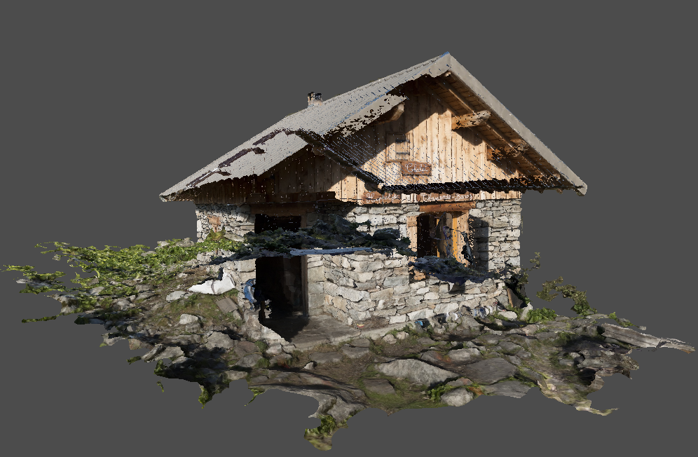

---

# Contents

- [Overview](#overview)
- [Camera](#camera)
- [Depth Buffer](#depth-buffer)
- [Improvements](#improvements)
- [Summary](#summary)

---

# Overview

In this chapter we will render the chalet model constructed previously and resolve various visual problems that arise.

Since we are now dealing with a model that has a specific orientation, the current view-transform matrix will be encapsulated into a _camera_ model that allows the application to more easily configure the view.  This will be extended in the next chapter to allow the camera to be dynamically controlled by the keyboard and mouse.

Finally various improvements are introduced to simplify configuration of the presentation process.

---

# Camera

## Normals Redux

Currently the application code is responsible for ensuring that vectors have been normalised as appropriate.  This either requires the overhead of checking whether a vector has already been normalised (albeit a relatively trivial test) or relying on documentation hints, neither of which are rigorous or explicit.

A better approach is to _enforce_ this requirement at compile-time, therefore the `Vector` class is extended by the introduction of specialisations for normals and the cardinal axes.

A _normal_ is a unit-vector:

```java
public class Normal extends Vector {
	public static final Layout LAYOUT = new Layout(SIZE, Type.NORMALIZED, true, Float.BYTES);

	public Normal(Vector vec) {
		super(normalize(vec));
	}
	
	public final float magnitude() {
		return 1;
	}
	
	public Normal invert() {
		return new Normal(super.invert());
	}
	
	public final Normal normalize() {
		return this;
	}
}
```

This new type is further specialised for the cardinal axes:

```java
public final class Axis extends Normal {
    public static final Axis
        X = new Axis(0),
        Y = new Axis(1),
        Z = new Axis(2);

	private final int index;
}
```

The vector of each axis is initialised in the constructor:

```java
private Axis(int ordinal) {
	var array = new float[Vector.SIZE];
	array[ordinal] = 1;

	Vector vector = new Vector(array);
	super(vector);
	this.ordinal = ordinal;
	this.invert = new Normal(vector.invert());
}
```

And finally the code to construct a rotation matrix about one of the cardinal axes is moved from the matrix class:

```java
public Matrix rotation(float angle) {
    var matrix = new Matrix.Builder().identity();
    float sin = MathsUtility.sin(angle);
    float cos = MathsUtility.cos(angle);
    switch(index) {
        case 0 -> matrix.set(...);
        ...
    }
    return matrix.build();
}
```

Note that this code switches on the `index` of the axis, this works fine for now but may be replaced later by an internal enumeration.

The purpose of these changes are:

1. The intent of code using the new types is now more expressive and type-safe, e.g. classes that _require_ a unit-vector can now enforce the `Normal` type explicitly.

2. Reduces the reliance on documented assumptions and defensive checks to ensure vectors are normalised, e.g. when generating rotation matrices.

3. The overhead of re-normalising is trivial where an already normalized vector is referenced as the base `Vector` type.

## Camera Model

The camera is a model class representing the position and orientation of the viewer:

```java
public class Camera {
    private Point position = Point.ORIGIN;
    private Normal direction = Axis.Z;
    private Normal up = Axis.Y;
}
```

Note that under the hood the camera direction is the inverse of the view direction, i.e. the camera points _out_ of the screen whereas the view is obviously _into_ the screen.

Mutators are provided to reposition the camera:

```java
public void move(Point position) {
    this.pos = notNull(position);
}

public void move(Vector vector) {
    position = position.add(vector);
}

public void move(float distance) {
    move(direction.multiply(distance));
}
```

And the following convenience method points the camera at a given target:

```java
public void look(Point target) {
	if(pos.equals(target)) {
		throw new IllegalArgumentException(...);
	}
	Vector look = Vector.between(target, position);
	direction(new Normal(look));
}
```

Where `between` is a new factory method on the vector class:

```java
public static Vector between(Point start, Point end) {
    float dx = end.x - start.x;
    float dy = end.y - start.y;
    float dz = end.z - start.z;
    return new Vector(dx, dy, dz);
}
```

Note that this camera model is subject to gimbal locking, e.g. if the direction is set to the _up_ axis.  Validation is added (not shown) to the relevant setters to prevent this occurring.  Later on we will replace the _direction_ property with a more advanced implementation for the camera orientation to mitigate this problem.

Next the following transient members are added to the camera class to support view transform:

```java
public class Camera {
    ...
    private Vector right = Axis.X;
    private Matrix matrix;
    private boolean dirty = true;
}
```

Where:

* The `dirty` flag is signalled in the various mutator methods (not shown) when any of the camera properties are modified.

* The `right` vector is the horizontal axis of the camera viewport (also used in the `strafe` method).

The view transform for the camera is constructed on demand:

```java
public Matrix matrix() {
    if(dirty) {
        update();
        dirty = false;
    }
    return matrix;
}
```

The `update` method first determines the viewport axes based on the camera axes:

```java
private void update() {
	right = up.cross(dir).normalize();
	Vector y = dir.cross(right).normalize();
	...
}
```

Where the _cross product_ yields the vector perpendicular to two other vectors (using the right-hand rule):

```java
public Vector cross(Vector vec) {
    float x = this.y * vec.z - this.z * vec.y;
    float y = this.z * vec.x - this.x * vec.z;
    float z = this.x * vec.y - this.y * vec.x;
    return new Vector(x, y, z);
}
```

And the view transformation matrix is constructed from the translation and rotation components as before:

```java
// Build translation component
Matrix translation = Matrix.translation(new Vector(position).invert());

// Build rotation component
Matrix rotation = new Matrix.Builder()
    .identity()
    .row(0, right)
    .row(1, y)
    .row(2, direction)
    .build();

// Create camera matrix
matrix = translation.multiply(rotation);
```

## Draw Command

The draw command is different for an indexed model, therefore we take the opportunity to implement a proper abstraction:

```java
public record DrawCommand(...) implements Command {
	/**
	 * Constructor.
	 * @param vertexCount			Number of vertices
	 * @param instanceCount			Number of instances
	 * @param firstVertex			First vertex
	 * @param firstInstance			First instance
	 * @param firstIndex			Optional starting index
	 * @param library				Drawing library
	 */
	public DrawCommand {
		...
	}
}
```

The new class selects the appropriate draw command:

```java
public void execute(Buffer buffer) {
	if(firstIndex == null) {
		library.vkCmdDraw(buffer, vertexCount, instanceCount, firstVertex, firstInstance);
	}
	else {
		library.vkCmdDrawIndexed(buffer, vertexCount, instanceCount, firstIndex, firstVertex, firstInstance);
	}
}
```

A companion builder is also implemented along with convenience factory methods for common use-cases:

```java
static DrawCommand draw(int count) {
    return new Builder().count(count).build();
}

static DrawCommand indexed(int count) {
    return new Builder().indexed().count(count).build();
}
```

Finally a further helper is implemented to create a draw command for a given mesh:

```java
public static DrawCommand of(Mesh mesh, LogicalDevice device) {
	var draw = new Builder();
	draw.vertexCount(mesh.count());

	if(mesh.index().isPresent()) {
		draw.indexed();
	}

	return draw.build(device);
}
```

The hard-coded draw command can now be replaced in the render sequence:

```java
Command draw = DrawCommand.of(mesh);
```

---

# Depth Buffer

## Integration #1

A new `ModelDemo` project is started based on the previous rotating cube demo.

The existing view-transform code is replaced with a camera:

```java
class CameraSetup {
    @Bean
    static Camera camera() {
        Camera camera = new Camera();
        camera.move(new Point(0, -0.5f, -2));
        return camera;
    }
}
```

The previous VBO configuration is replaced with a new class that loads the persisted mesh:

```java
@Configuration
class Model {
	@Bean
	static Mesh load() throws IOException {
		Path path = Path.of("chalet.model");
		var loader = new MeshLoader();
		...
		return loader.load(path);
	}
}
```

To assist debugging the `load` method regenerates the model if the file is not present:

```java
if(!path.toFile().exists()) {
	Mesh mesh = create();
	loader.write(mesh, path);
}
```

Where `create` loads and builds the OBJ model:

```java
private static Mesh create() throws IOException {
	var path = Path.of("chalet.obj");
	var loader = new ObjectModelLoader();
	try(var in = Files.newBufferedReader(path)) {
		return loader.load(in).getFirst();
	}
}
```

The VBO and index buffers are created for the mesh:

```java
@Bean
static VertexBuffer vbo(Mesh mesh) {
    VulkanBuffer buffer = buffer(mesh.vertices(), VkBufferUsage.VERTEX_BUFFER);
    return new VertexBuffer(buffer);
}

@Bean
static IndexBuffer index(Mesh mesh) {
    VulkanBuffer buffer = buffer(mesh.index().get(), VkBufferUsage.INDEX_BUFFER);
    return new IndexBuffer(buffer, VkIndexType.UINT32);
}
```

Which both delegate to the following helper:

```java
private VulkanBuffer buffer(Allocator allocator, MeshData data, VkBufferUsage usage) {
    // Create staging buffer
    VulkanBuffer staging = VulkanBuffer.staging(allocator, data);

    // Init buffer memory properties
    var properties = new MemoryProperties.Builder<VkBufferUsage>()
        .usage(VkBufferUsage.TRANSFER_DST)
        .usage(usage)
        .required(VkMemoryProperty.DEVICE_LOCAL)
        .build();

    // Create buffer
    var buffer = VulkanBuffer.create(allocator, staging.length(), properties);

    // Copy staging to buffer
    staging.copy(buffer).submit(graphics);

    // Release staging
    staging.destroy();

    return buffer;
}
```

And finally the index is bound in the render configuration:

```java
@Bean("index.bind")
static Command index(IndexBuffer index) {
    return index.bind(0);
}
```

The chalet model is orientated with the viewer looking down from above, therefore a _model_ transformation is added:

```java
@Bean
static Matrix modelmatrix() {
	Matrix tilt = new AxisAngle(Axis.X, toRadians(-90)).matrix();
	Matrix rot = new AxisAngle(Axis.Y, toRadians(120)).matrix();
	return rot.multiply(tilt);
}
```

Where:

* The _tilt_ orientates the model so the view is from the side.

* And _rot_ rotates vertically such that the camera is facing the corner of the chalet with the door.

* Note that the camera was also moved slightly above the 'ground' level.

The view transform now comprises _three_ matrices that will be composed in the shader rather than multiplied together in code:

```glsl
layout(set=0, binding=1) uniform Matrices {
    mat4 projection;
    mat4 view;
    mat4 model;
};
```

Which are multiplied together to transform each vertex:

```glsl
void main() {
    gl_Position = projection * view * model * vec4(pos, 1.0);
    fragCoords = coords;
}
```

The uniform buffer is expanded to account for the three elements:

```java
static VulkanBuffer uniformBuffer(Allocator allocator) {
	...
	long length = 3 * Matrix.LAYOUT.stride();
	return VulkanBuffer.create(allocator, length, properties);
}
```

And initialised as follows:

```java
@Bean
static Resource uniform(VulkanBuffer uniformBuffer, Matrix projection, Camera camera, Matrix modelmatrix) {
	var uniform = new ResourceBuffer(VkDescriptorType.UNIFORM_BUFFER, 0L, buffer);
	ByteBuffer bb = matrixBuffers[n].buffer();
	projection.buffer(bb);
	camera.matrix().buffer(bb);
	modelmatrix.buffer(bb);
	return uniform;
}
```

When we run the demo the results are a bit of a mess:


There are a couple of issues here but the most obvious is that the texture appears to be upside down, the grass is obviously on the roof and vice-versa.

## Texture Coordinate Invert

The upside-down texture is due to the fact that OBJ texture coordinates (and OpenGL) assume an origin at the bottom-left corner of the image whereas Vulkan uses the top-left corner.

The texture coordinates _could_ be fiddled by one of the following options:

* Flip the vertical texture component in the vertex shader.

* Flip the image once using an image editing package - just adds an extra manual step.

* Invert the image programmatically at load-time - makes loading slower.

However none of these resolve the actual root problem, a better solution is to perform the flip _once_ when the OBJ model is constructed off-line.

The following adapter flips the vertical texture coordinate:

```java
private static Coordinate2D flip(float[] array) {
    assert array.length == 2;
    return new Coordinate2D(array[0], -array[1]);
}
```

And the parser in the OBJ loader is updated accordingly:

```java
add("vt", new VertexComponentParser<>(2, ObjectModelLoader::flip, model.coordinates()));
```

We assume that this will apply to all OBJ models, it can always be made an optional feature if that assumption turns out to be incorrect.

After regenerating the model it now looks to be textured correctly, in particular the signs on the front of the chalet are the right way round (so the model is not being rendered inside-out for example):



## Depth Test

The second problem is that fragments are being rendered arbitrarily overlapping.  This is solved by enabling the _depth test_ which ensures that obscured fragments are either overwritten by nearer geometry or discarded altogether, based on distance from the camera.

The depth test is configured by a new pipeline stage:

```java
public class DepthStencilStage extends AbstractPipelineBuilder<VkPipelineDepthStencilStateCreateInfo> {
    private final VkPipelineDepthStencilStateCreateInfo info = new VkPipelineDepthStencilStateCreateInfo();

    public DepthStencilStageBuilder() {
        enable(false);
        write(true);
        compare(VkCompareOp.LESS);
    }
}
```

The depth test uses the _depth buffer_ which is a special attachment that records the distance of each rendered fragment, and discards subsequent fragments that are hidden.

Since we are now dealing with multiple types of attachments the existing framework needs to be revised to support both.  Additionally in the previous demos the clear value for the colour attachments was hard-coded, with the addition of the depth buffer this functionality now needs to be properly implemented.

## Attachments

The following are required to support both colour and depth attachments:

* The attachment description.

* An optional clear value with properties specific to that type of attachment.

* The image views for that attachment: either the swapchain images for the colour attachment or the _single_ depth-stencil attachment.

Perhaps surprisingly there is no equivalent Vulkan object for an 'attachment' as such, or an enumeration to differentiate the various types of attachment.  Therefore we introduce the following new type that aggregates these properties:

```java
public class Attachment {
	public enum AttachmentType {
		COLOUR,
		DEPTH
	}

	private final AttachmentType type;
	private final AttachmentDescription description;
	private final IntFunction<View> views;
	private ClearValue clear;
}
```

Where:

* The attachment `type` allows the code to switch behaviour as required without trying to derive the 'type' from the description.

* The `views` function returns the image-views for that attachment.

The existing attachment reference is also moved into this new type and a helper can now be implemented to create simple references:

```java
public Reference reference() {
	VkImageLayout layout = switch(type) {
		case COLOUR -> VkImageLayout.COLOR_ATTACHMENT_OPTIMAL;
		case DEPTH	-> VkImageLayout.DEPTH_STENCIL_ATTACHMENT_OPTIMAL;
	};
	return new Reference(this, layout);
}
```

## Clear Values

Introducing clear values should have been easy, however there was a nasty surprise when adding the depth-stencil to the demo, with JNA throwing the infamous `Invalid memory access` error.  Eventually we realised that `VkClearValue` and `VkClearColorValue` are in fact __unions__ and not structures.  Vulkan is expecting __either__ a colour array __or__ a depth floating-point value, whereas we are currently sending both for all attachments, probably resulting in some sort of buffer offset problem.

> Presumably the original code with a single clear value only worked by luck because the code generator treated the union as a plain structure and the properties for a colour attachment happen to be the first field in each object, i.e. the `color` and `float32` properties.

As far as we can tell this is the __only__ instance of the use of a union in the whole Vulkan API!  Thankfully JNA supports unions out-of-the-box and the generated code could be manually modified.

A clear value is defined by the following abstraction:

```java
public sealed interface ClearValue {
    static void populate(VkClearValue value) {
    	...
    }
}
```

The temporary code can now be moved to a new implementation for colour attachments:

```java
record ColourClearValue(Colour col) implements ClearValue {
    public void populate(VkClearValue value) {
        value.setType("color");
        value.color.setType("float32");
        value.color.float32 = col.toArray();
    }
}
```

The `setType` method of a JNA union is used to 'select' the relevant properties.  

A second implementation is added for the depth-stencil attachment:

```java
record DepthClearValue(Percentile depth) implements ClearValue {
    /**
     * Default clear value for a depth attachment.
     */
    public static final DepthClearValue DEFAULT = new DepthClearValue(Percentile.ONE);

    public void populate(VkClearValue value) {
        value.setType("depthStencil");
        value.depthStencil.depth = depth.floatValue();
        value.depthStencil.stencil = 0;
    }
}
```

Finally the `begin` method of the frame buffer is updated to populate the clear values at the start of the render-pass:

```java
// Enumerate clear values
List<ClearValue> clear = pass
	.attachments()
    .stream()
    .map(Attachment::clear)
    .toList();

// Init clear values
info.clearValueCount = clear.size();
info.pClearValues = StructureCollector.pointer(clear, new VkClearValue(), ClearValue::populate);
```

## Integration #2

To use the depth test in the demo a new depth-stencil attachment is added to the configuration:

```java
AttachmentDescription description = new AttachmentDescription.Builder()
    .format(VkFormat.D32_SFLOAT)
    .load(VkAttachmentLoadOp.CLEAR)
    .finalLayout(VkImageLayout.DEPTH_STENCIL_ATTACHMENT_OPTIMAL)
    .build();

Attachment depth = new Attachment(AttachmentType.DEPTH, description, _ -> view);
```

Notes:

* The format of the depth buffer is temporarily hard-coded to `D32_SFLOAT` which is commonly available on most Vulkan implementations.

* The _store_ operation is left as the `DONT_CARE` default.

* Similarly the _old layout_ property is `UNDEFINED` since the previous contents are not relevant for the depth-stencil.

* The depth attachment returns a _single_ image view.

The depth attachment is then added to the render pass:

```java
Subpass subpass = new Subpass()
    .add(colour.reference())
    .add(depth.reference(VkImageLayout.DEPTH_STENCIL_ATTACHMENT_OPTIMAL))
    ...
```

Unlike the swapchain images the application is responsible for creating and managing the image for the depth buffer attachment.
First the properties of the image are specified:

```java
@Bean
public View depth(Swapchain swapchain, Allocator allocator) {
    var descriptor = new Image.Descriptor.Builder()
        .aspect(VkImageAspect.DEPTH)
        .extents(swapchain.extents())
        .format(VkFormat.D32_SFLOAT)
        .build();
        
    ...
}
```

Next the image is instantiated:

```java
var props = new MemoryProperties.Builder<VkImageUsageFlag>()
    .usage(VkImageUsageFlag.DEPTH_STENCIL_ATTACHMENT)
    .required(VkMemoryProperty.DEVICE_LOCAL)
    .build();

Image image = new Image.Builder()
    .descriptor(descriptor)
    .tiling(VkImageTiling.OPTIMAL)
    .properties(props)
    .build(dev, allocator);
```

From which a view is created:

```java
return new View.Builder(image).build();
```


The clear values for the demo can now be configured:

```java
colour.clear(new ColourClearValue(...));
depth.clear(new DepthClearValue(1));
```

Finally the depth test is enabled in the pipeline configuration:

```java
.depth()
    .enable(true)
    .build()
```

Notes:

* Depth buffer images do not need to be programatically transitioned as Vulkan automatically manages the image during the render pass.

* The same depth buffer can safely be used in each frame since only a single subpass will be be rendering at any one time.

With the depth buffer enabled we should finally be able to see the chalet model:


Ta-da!

---

# Improvements

## Format Selector

Rather than hard-coding the format of the depth buffer the following helper is implemented to select a suitable format from a list of candidates:

```java
public class FormatSelector {
    private final PhysicalDevice dev;
    private final Predicate<VkFormatProperties> filter;

    public Optional<VkFormat> select(List<VkFormat> candidates) {
        return candidates
			.stream()
			.filter(this::matches)
			.findAny();
    }
}
```

The `matches` method looks up the properties of each candidate from the device and applies the predicate:

```java
private boolean matches(VkFormat format) {
    VkFormatProperties props = dev.properties(format);
    return filter.test(props);
}
```

The following factory method creates a format predicate for optimal or linear tiling features:

```java
public static Predicate<VkFormatProperties> filter(boolean optimal, Set<VkFormatFeature> features) {
    BitMask<VkFormatFeature> mask = new BitMask<>(required);
    return props -> {
        BitMask<VkFormatFeature> supported = optimal ? props.optimalTilingFeatures : props.linearTilingFeatures;
        return supported.contains(mask);
    };
}
```

A convenience constructor (not shown) is also added to create a selector using the `filter` factory method.

The optimal format can now be selected in the demo when configuring the depth buffer:

```java
@Bean
public View depth(Swapchain swapchain, Allocator allocator) {
    FormatSelector selector = new FormatSelector(dev.parent(), true, VkFormatFeature.DEPTH_STENCIL_ATTACHMENT);
    VkFormat format = selector.select(VkFormat.D32_SFLOAT, VkFormat.D32_SFLOAT_S8_UINT, VkFormat.D24_UNORM_S8_UINT).orElseThrow();
    ...
}
```

## Swapchain Configuration

We also make some modifications to the configuration of the swapchain to select various properties rather than hard-coding.

First the following helper is added to the surface class to select an image format, falling back to a default format if the requested configuration is not available:

```java
public VkSurfaceFormatKHR format(VkFormat format, VkColorSpaceKHR space, VkSurfaceFormatKHR def) {
    return this
        .formats()
        .stream()
        .filter(f -> f.format == format)
        .filter(f -> f.colorSpace == space)
        .findAny()
        .or(() -> Optional.ofNullable(def))
        .orElseGet(Surface::defaultSurfaceFormat);
}
```

Where the following factory creates the commonly supported default format:

```java
public static VkSurfaceFormatKHR defaultSurfaceFormat() {
    // Create surface format
    var format = new VkSurfaceFormatKHR();
    format.colorSpace = VkColorSpaceKHR.SRGB_NONLINEAR_KHR;

    // Init default swapchain image format
    format.format = new FormatBuilder()
        .components("BGRA")
        .bytes(1)
        .signed(false)
        .type(FormatBuilder.Type.NORM)
        .build();

    return format;
}
```

A second helper is added to select a preferred presentation mode:

```java
public VkPresentModeKHR mode(VkPresentModeKHR... modes) {
    Set<VkPresentModeKHR> available = this.modes();
    return Arrays
        .stream(modes)
        .filter(available::contains)
        .findAny()
        .orElse(DEFAULT_PRESENTATION_MODE);
}
```

The configuration of the swapchain is now more robust:

```java
public Swapchain swapchain(Surface surface, ApplicationConfiguration cfg) {
    // Select presentation mode
    VkPresentModeKHR mode = surface.mode(VkPresentModeKHR.MAILBOX_KHR);

    // Select SRGB surface format
    VkSurfaceFormatKHR format = surface.format(VkFormat.B8G8R8_UNORM, VkColorSpaceKHR.SRGB_NONLINEAR_KHR, null);

    // Create swapchain
    return new Swapchain.Builder(dev, surface)
        .count(cfg.getFrameCount())
        .clear(cfg.getBackground())
        .format(format)
        .presentation(mode)
        .build();
}
```

## Global Flip

By default the Vulkan Y axis points __down__ which is the opposite direction to OpenGL (and just about every other 3D library).

However we came across a global solution that handily flips the vertical axis by specifying a 'negative' viewport rectangle: [Flipping the Vulkan viewport](https://www.saschawillems.de/blog/2019/03/29/flipping-the-vulkan-viewport/)

The implementation is relatively trivial:

```java
public Viewport flip() {
    int y = rectangle.y() + rectangle.height();
    int h = -rectangle.height();
    Rectangle flip = new Rectangle(rectangle.x(), y, rectangle.width(), h);
    return new Viewport(flip, min, max);
}
```

Notes:

* This solution is only supported in Vulkan version 1.1.x or above.

* The Y coordinate of the viewport origin is also shifted to the bottom of the viewport.

However we eventually decided against using this as the default implementation for a couple of reasons:

1. This is a breaking change for existing code since flipping the Y axis also essentially flips the triangle winding order.

2. The implementation actually flips the _coordinate space_ rather than simply flipping the frame buffer.  This means that __all__ code still needs to be aware that the global flip is enabled (e.g. for the camera model and view transform later on) which seems to defeat the object.

Therefore `flip` is an optional helper method and we just accept that the Y direction is __down__ from this point forwards.

---

# Summary

This chapter introduced the _depth test_ by implementation of the following:

- A camera model.

- Vertex normals and the cardinal axes.

- A builder for draw commands.

- Texture coordinate inversion for OBJ models.

- The depth-stencil pipeline stage.

- A refactored attachment class to support both colour and depth-stencil attachments.

- A mechanism to configure attachment clear values.

