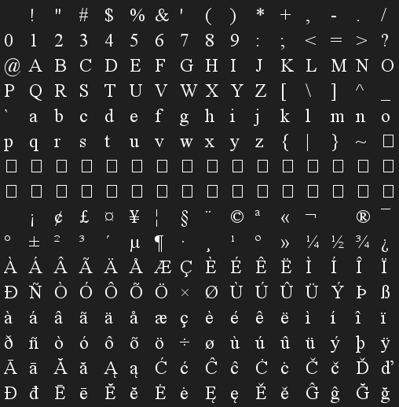
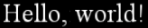
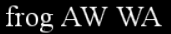

---

## Contents

- [Overview](#overview)
- [Glyphs](#glyphs)
- [Metadata](#glyph-metadata)

---

## Overview

Rendering text using Vulkan is (or can be) a surprisingly complex challenge for a variety of reasons:

* Most of the available frameworks (including the Java AWT implementation) are ultimately based on TrueType fonts where the various character _glphys_ are represented under-the-hood using splines and vectors, which are then converted to bitmaps for rendering.  However the GPU rendering pipeline is specialised around shaders and only works in terms of vertices and texture coordinates.  Therefore the most common approach is to create a texture containing the glyphs for a given font and point size (usually arranged as a grid).  Arbitrary text can be then rendered as a vertex buffer comprising a quad for each character with texture coordinates derived from the grid.

* Unless the font is mono-spaced the character glyphs have different widths, known as the _advance_ of each character, implying that each glyph also requires additional metadata for layout purposes.

* Multi-line text implies a rendering approach where each word is wrapped against a _margin_ and optionally justified or centred, with further metadata for font heights and line spacing.

* Many fonts also alter the spacing between certain pairs of characters to achieve a better looking result (known as _kerning_ pairs), a good example is the capital A and W characters which can be rendered slightly overlapping each other.  Unfortunately the necessary kerning information is often not visible requiring some sort of off-line utility that generates both the texture font and the metadata on a glyph-by-glyph basis.

* Depending on the specific font certain groups of characters can also be combined into a single _ligature_ glyph, for example lower-case `f` followed by `i` in Times New Roman fonts.

* All of the above imply that colour blending is required for text rendering given that glyphs can often overlap.

Note that for the moment ligatures and non-Latin fonts will be out-of-scope.

The following new components will be required:

* A representation of the glyph metadata.

* The off-line tool to generate the texture font and metadata.

* A custom mesh builder that constructs the vertex buffer for a given piece of text, including word and line-wrapping.

* The colour blending pipeline stage.

TODO - static vs dynamic (i.e. add char)

Initially we will generate a texture image for a simple mono-spaced demo before addressing font metadata and proper spacing with colour blending later in the chapter.


assumptions
- square texture font
- row major
- contiguous character set including starting offset
- assumes end = tiles + start

exclusions
- ligatures
- unicode


---

## Glyphs

### Glyph Texture

There are many utility applications in the wild that generate texture fonts and the associated metadata, however the file formats are often very strange (and there does not appear to be many standards) which would require tedious formatting and/or parsing.  Additionally many of the tools do not export all the required metadata (particularly kerning properties).  Our requirements are fairly trivial so it makes sense to create our own custom tool using Java AWT fonts.

The generator is essentially a builder with the following properties:

```java
public class TextureFontGenerator {
    private int size = 512;
    private int tiles = 16;
    private char start = 0;
    private Color back = new Color(0, 0, 0, 0);
    private Color text = Color.WHITE;
}
```

Where:

* The _size_ is the pixel dimensions of the texture (which is assumed to be square).

* The _tiles_ is the number of glyphs in each direction, i.e. a 16 x 16 grid.

* And _start_ is the code-point of the first glyph.

The texture image (and later also the metadata) are generated by an _instance_ of the generator for a given font:

```java
public class Instance {
    private final Font font;

    public BufferedImage image() {
        ...
    }
}
```

The `image` method creates the actual texture:

```java    
// Create texture font image
var image = new BufferedImage(size, size, BufferedImage.TYPE_4BYTE_ABGR);

// Clear translucent background
var g = (Graphics2D) image.getGraphics();
g.setBackground(back);
g.clearRect(0, 0, size, size);

// Set text colour
g.setFont(font);
g.setColor(text);
```

Each character in the configured range is then drawn to the image as a row-major grid:

```java
int w = size / tiles;
int offset = metrics.getAscent();
char ch = start;
for(int r = 0; r < tiles; ++r) {
    int y = r * w + offset;
    for(int c = 0; c < tiles; ++c) {
        int x = c * w;
        g.drawChars(new char[]{ch}, 0, 1, x, y);
        ++ch;
    }
}
```

### Command Line Utility

To wrap the generator as a command line utility we employed the rather neat [picocli](https://github.com/remkop/picocli#readme) library that handles argument parsing and auto-magically generates error messages, help and command completion.

First a command line runner is created that defines the various application parameters and options:

```java
@Command(name="texturefont", description="Generates the image grid and associated metadata for a texture font")
private static class Runner implements Callable<Integer> {
    private enum Style {
        PLAIN,
        BOLD,
        ITALIC
    }

    @Parameters(index="0", description="Name of the font to be generated")
    private String name;

    @Parameters(index="1", description="Point size")
    private int size;

    @Option(names={"-s", "--style"}, description="Font style: ${COMPLETION-CANDIDATES}")
    private Style style = Style.PLAIN;
}
```

Note that a local enumeration is defined for the various font styles which is more explicit than the plain integer constants used in the AWT `Font` class (using the same ordinal values).

The runner creates the font from the supplied parameters and outputs the resultant texture image:

```java
public Integer call() throws Exception {
    // Create font
    Font font = new Font(name, style.ordinal(), size);

    // Generate texture font
    var generator = new TextureFontGenerator();
    Instance instance = generator.new Instance(font);
    BufferedImage image = instance.image();

    // Output texture font
    String filename = String.format("%s%d.png", font.getFontName(), font.getSize());
    ImageIO.write(image, ext, new File(filename));
    return 0;
}
```

Which is invoked as follows:

```java
public static void main(String[] args) {
    var cmd = new CommandLine(new Runner());
    int exit = cmd.execute(args);
    System.exit(exit);
}
```

If a required parameter is missing or a supplied option is invalid `picocli` generates a handy usage message, for example:

```
Invalid value for option '--style': expected one of [PLAIN, BOLD, ITALIC] (case-sensitive) but was 'COBBLERS'
Usage: texturefont [-k] [-s=<style>] <name> <size>
      <name>            Name of the font to be generated
      <size>            Point size
  -k, --kerning         Disable kerning
  -s, --style=<style>   Font style: PLAIN, BOLD, ITALIC
```

Cool.

### Mesh Builder

The vertex buffer for a texture font is constructed by a new builder:

```java
public class GlyphMeshBuilder {
    private final MeshBuilder mesh = new MeshBuilder(Primitive.TRIANGLE, new CompoundLayout(Point.LAYOUT, Coordinate2D.LAYOUT));
    private final int tiles;
    private final float size;
    private float x, y;

    public GlyphMeshBuilder(int tiles) {
        this.tiles = tiles;
        this.size = 1f / tiles;
    }
}
```

Where:

* The _tiles_ is the granularity of the texture font, i.e. the number of glyphs in each row and column.

* The _scale_ sets the size of the rendered text.

* And _x_ and _y_ is the _cursor_ position of the next character to be added to the mesh.

The builder generates a quad for each character added to the mesh:

```java
public GlyphMeshBuilder add(char ch) {
    // Lookup glyph for this character
    Glyph glyph = font.glyph(ch);

    // Render glyph
    if(!Character.isWhitespace(ch)) {
        build(ch);
    }

    // Advance cursor for next character
    x += glyph.advance();

    return this;
}
```

Note that whitespace characters only advance the cursor since there is no point rendering blank glyphs.

The quad for each character is comprised of two counter-clockwise triangles:

```java
```

The texture coordinates for each quad are calculated by the following helper:

```java
private Corners corners(int index) {
    float u = (index % tiles) * size;
    float v = (index / tiles) * size;
    var topLeft = new Coordinate2D(u, v);
    var bottomRight = new Coordinate2D(u + size, v + size);
    return new Corners(topLeft, bottomRight);
}
```

Where `Corners` is a simple convenience type for a pair of texture coordinate corners.

This implementation assumes that the glyphs are arranged in row-major order in the texture.

### Integration #1

To exercise the texture font the image is generated by the command line utility which should produce something along these lines:



Next a new demo application is created consisting of:

* A rendering pipeline with the basic vertex and texture sampling fragment shaders.

* A texture for the font image.

* And a vertex buffer for the text mesh.

The VBO is configured with a hard-coded texture font for the moment:

```java
@Configuration
public class VertexBufferConfiguration {
    @Bean
    static Mesh mesh() {
        return new GlyphMeshBuilder(16)
            .scale(2)
            .add("Hello, world!")
            .mesh();
}
```

Running the new demo should generate a fairly simple (if ugly) piece of text:


The demo has managed to render _something_ but there are several obvious visual problems:

* The glyphs are not spaced nicely since the character advance is currently hard-coded.

* Some glyphs are obviously being clipped rather than blending together.

* The font looks basically awful (compared to the generated texture) since the glyphs are not being anti-aliased.

---

## Glyph Metadata

### Colour Blending

To correctly render the anti-aliased glyphs and blend any overlapping characters the _colour blending_ pipeline stage is introduced.

There are two mutually exclusive approaches for colour blending:

* Global bitwise combination specified by the `VkPipelineColorBlendStateCreateInfo` structure.

* Per framebuffer configuration specified by a `VkPipelineColorBlendAttachmentState` for each framebuffer attachment.

The pipeline stage builder is defined as follows:

```java
public class ColourBlendStageBuilder extends AbstractStageBuilder<VkPipelineColorBlendStateCreateInfo> {
    private final VkPipelineColorBlendStateCreateInfo info = new VkPipelineColorBlendStateCreateInfo();
    private final List<AttachmentBuilder> attachments = new ArrayList<>();

    public ColourBlendStageBuilder() {
        info.flags = 0;
        info.logicOpEnable = false;
        info.logicOp = VkLogicOp.COPY;
        Arrays.fill(info.blendConstants, 1);
    }
}
```

The text demo will use the second approach (the most commonly used) which requires a nested builder for the attachment colour blending configuration:

```java
public AttachmentBuilder attachment() {
    var builder = new AttachmentBuilder();
    builder.enabled = true;
    attachments.add(builder);
    return builder;
}
```

The attachment configuration specifies the source and destination blend factors for the colour and alpha channels:

```java
public class AttachmentBuilder {
    private static final List<VkColorComponent> MASK = Arrays.asList(VkColorComponent.values());

    private final BlendOperationBuilder colour = new BlendOperationBuilder(VkBlendFactor.SRC_ALPHA, VkBlendFactor.ONE_MINUS_SRC_ALPHA);
    private final BlendOperationBuilder alpha = new BlendOperationBuilder(VkBlendFactor.ONE, VkBlendFactor.ZERO);
    private List<VkColorComponent> mask = MASK;
    private boolean enabled;
}
```

Where the `BlendOperationBuilder` is a further nested builder for the blending properties of the colour and alpha channels:

```java
public class AttachmentBuilder {
    public class BlendOperationBuilder {
        private VkBlendFactor src;
        private VkBlendFactor dest;
        private VkBlendOp blend = VkBlendOp.ADD;
    }
}
```

The structure for the frame buffer attachment is populated as follows:

```java
private void populate(VkPipelineColorBlendAttachmentState info) {
    // Init descriptor
    info.blendEnable = enabled;

    // Init colour blending operation
    info.srcColorBlendFactor = colour.src;
    info.dstColorBlendFactor = colour.dest;
    info.colorBlendOp = colour.blend;

    // Init alpha blending operation
    info.srcAlphaBlendFactor = alpha.src;
    info.dstAlphaBlendFactor = alpha.dest;
    info.alphaBlendOp = alpha.blend;

    // Init colour write mask
    info.colorWriteMask = new BitMask<>(mask);
}
```

Which is added to the global blending configuration:

```java
VkPipelineColorBlendStateCreateInfo get() {
    if(attachments.isEmpty()) {
        attachments.add(new AttachmentBuilder());
    }

    info.attachmentCount = attachments.size();
    info.pAttachments = StructureCollector.pointer(attachments, new VkPipelineColorBlendAttachmentState(), AttachmentBuilder::populate);
    return info;
}
```

Note that at least one attachment must be configured, hence the logic in the above builder code to add a default attachment with colour blending disabled.

The only integration change is to enable colour blending in the pipeline configuration of the demo:

```java
public Pipeline pipeline(...) {
    return new GraphicsPipelineBuilder(pass)
        ...
        .blend()
            .attachment()
                .build()
            .build()
        .build(...)
}
```

The demo should now render glyphs that are less ugly and without clipping:


### Glyph Font

To correct the text spacing the following new type specifies the metadata for a glyph:

```java
public record Glyph(int code, float advance)
```

Where _code_ is the character code-point and _advance_ defines the _cursor_ position of the next character.

A glyph _font_ describes a set of glyphs which are assumed to be arranged as a row-major grid in the associated texture:

```java
public class GlyphFont {
    private final int start;
    private final List<Glyph> glyphs;
    private final int tiles;
}
```

Where _tiles_ specifies the granularity of the texture font (replacing the equivalent property of the mesh builder).

The _start_ property is the index of first character in the font, glyphs can then be retrieved relative to this offset:

```java
public Glyph glyph(char ch) {
    return glyphs.get(ch - start);
}
```

> Note that this implementation assumes that the glyphs are essentially a contiguous array, which works fine for this demo but may turn out to be inflexible for other applications.

The font metadata _could_ be generated on-the-fly for a given font, however the various AWT classes are highly coupled and dependant on a `Graphics` context.  Since we already have an offline tool to generate the texture image it seems logical to generate and persist the metadata at the same time using the same context.  The application will then load and parse the metadata to a `GlyphFont` instance to render correctly spaced text.

A second step is added to the generator to build the metadata for a texture font:

```java
public GlyphFont metadata() {
    // Retrieve font metrics
    List<Glyph> glyphs = IntStream
        .range(start, end())
        .mapToObj(this::glyph)
        .toList();

    // Create glyph font
    return new GlyphFont(start, glyphs, tiles);
}
```

Where `end` calculates the end character index of the configured range based on the number of tiles:

```java
private int end() {
    return start + tiles * tiles;
}
```

The character advance for each glyph is then generated as follows:

```java
Glyph glyph(int ch) {
    int advance = metrics.charWidth(ch);
    float scaled = advance / (float) size;
    return new Glyph(ch, scaled);
}
```

Where `metrics` is the AWT `FontMetrics` derived from the graphics context of the texture image.

Note that the advance is normalised to the dimensions of the texture image, i.e. essentially a texture coordinate offset.

### Persistence

The metadata will be persisted as a YAML document.

First the list of glyphs in the font are transformed to YAML objects (which are essentially just a map of named properties):

```java
public static void write(GlyphFont font, Writer out) {
    var glyphs = font.glyphs
        .stream()
        .map(Loader::write)
        .toList();
}
```

Using the following helper to output the properties for each glyph:

```java
private static Object write(Glyph glyph) {
    var map = new HashMap<String, Object>();
    map.put("code", glyph.code());
    map.put("advance", glyph.advance());
    return map;
}
```

A YAML object is created for the glyph font properties:

```java
var data = Map.of(
    "start",    font.start,
    "tiles",    font.tiles,
    "glyphs",   glyphs
);
```

Which is then written as a YAML document:

```java
Yaml yaml = new Yaml();
yaml.dump(data, out);
```

And finally the generated metadata is output by the tool along with the texture image:

```java
public Integer call() throws Exception {
    ...
    GlyphFont.Loader.write(metadata, new FileWriter(filename(font, "yaml")));
}
```

The persistence code is wrapped into a new loader component that will be used by the mesh builder:

```java
public static class Loader implements ResourceLoader<Element, GlyphFont> {
    private final YamlLoader loader = new YamlLoader();

    public Element map(InputStream in) throws IOException {
        return loader.load(new InputStreamReader(in));
    }
}
```

Where the `Element` class is a custom wrapper for node-based documents such as XML or YAML that somewhat simplifies document parsing.

The `load` method parses the metadata:

```java
public GlyphFont load(Element doc) throws Exception {
    int start = doc.text("start").map(Integer::parseInt).orElse(0);
    int tiles = doc.text("tiles").map(Integer::parseInt).orElse(16);
    List<Glyph> glyphs = doc.child("glyphs").children().map(Loader::glyph).toList();
    return new GlyphFont(start, glyphs, tiles);
}
```

Where each glyph is loaded by the following helper:

```java
private static Glyph glyph(Element doc) {
    int code = doc.child("code").transform(Integer::parseInt);
    float advance = doc.child("advance").transform(Float::parseFloat);
    return new Glyph(advance);
}
```

### Integration #2

The glyph mesh builder is modified to include the metadata:

```java
public class GlyphMeshBuilder {
    private final GlyphFont font;
}
```

And the cursor position can now be incremented by the character advance of each glyph:

```java
TODO
        if(prev != null) {
            final float advance = 1/16f; // prev.advance(ch) * scale;
            cursor = new Point(cursor.x + advance, cursor.y, cursor.z);
        }
        prev = glyph;
```


In the demo application the hard-coded bean is modified to load the generated metadata:

```java
static GlyphFont font(DataSource classpath) {
    var loader = new ResourceLoaderAdapter<>(classpath, new GlyphFont.Loader());
    return loader.load("DemoFont.yaml");
}
```

After running the utility to generate the metadata, the demo should now render the text with more pleasing spacing:



### Kerning

The final improvement is to add _kerning pairs_ to the glyph metadata.

Unfortunately the AWT font library (and many others) are understandably orientated around text rendering rather than providing a font API as such, the kerning information is usually a hidden implementation detail and is only manifested when sizing a piece of text.  Therefore to determine the kerning pairs for a given font the only solution is to 'render' each possible pair of characters and test whether their total advance is different from the sum of the individual characters.

First the glyph class is modified to include kerning pairs:

```java
public record Glyph(int code, float advance, Map<Character, Float> kerning) {
    public static final Map<Character, Float> DEFAULT_KERNING = Map.of();
}
```

And a second `advance` overload is added to lookup the advance of a glyph based on the _following_ character falling back to the default if there is no kerning for a given pair:

```java
public float advance(char next) {
    return kerning.getOrDefault(next, advance);
}
```

To generate the metadata the utility application is modified to optionally enable kerning for a given AWT font:

```java
private Font font() {
    Font font = new Font(name, style.ordinal(), size);
    if(kerning) {
        return font.deriveFont(Map.of(TextAttribute.KERNING, TextAttribute.KERNING_ON));
    }
    else {
        return font;
    }
}
```

The following new method generates the kerning pairs for a given character glyph, starting with a two-character string of the candidate pair:


```java
private Map<Integer, Float> kerning(int ch, int advance) {
    // Ignore non-text characters
    if(!isValid(ch)) {
        return Map.of();
    }

    // Init character pair
    StringBuilder str = new StringBuilder();
    str.append((char) ch);
    str.append(SPACE);
    
    // Enumerate kerning pairs
    Map<Integer, Float> kerning = new HashMap<>();
    ...
    
    return kerning;
}
```

Where the `isValid` test applies a crude restriction on the possible character combinations:

```java
private static boolean isValid(int ch) {
    return Character.isLetterOrDigit(ch) && !Character.isWhitespace(ch);
}
```

The following loop then iterates of each valid pair of characters:

```java
int end = end();
for(char next = start; next < end; ++next) {
    // Skip non-text characters
    if(!isValid(next)) {
        continue;
    }
    
    ...
}
```

And the total advance of both is calculated from the font metrics:

```java
str.setCharAt(1, next);
int total = metrics.stringWidth(str.toString());
```

If this value is different to the sum of the character advances a kerning pair has been found:

```java
int w = metrics.charWidth(next);
if(total != advance + w) {
    int k = total - w;
    kerning.put((int) next, k / (float) size);
}
```

Note that the resultant kerning advance is also scaled to the texture dimensions.

The glyph font loader is modified to persist the kerning pairs:

```java
private static Glyph glyph(Element doc) {
    float advance = doc.child("advance").transform(Float::parseFloat);
    var kerning = doc.optional("kerning").map(Loader::kerning).orElse(Glyph.DEFAULT_KERNING);
    return new Glyph(advance, kerning);
}
```

Which consists of a list of pairs:

```java
private static Map<Character, Float> kerning(Element doc) {
    return doc
        .children()
        .map(Loader::pair)
        .collect(toMap(Entry::getKey, Entry::getValue));
}
```

Each comprising the following character and the advance override:

```java
private static Entry<Character, Float> pair(Element doc) {
    char ch = doc.name().charAt(0);
    float advance = doc.text().transform(Float::parseFloat);
    return Map.entry(ch, advance);
}
```

Finally the output method is also modified to write the kerning metadata:

```java
private static Object write(Glyph glyph) {
    ...
    var kerning = glyph.kerning();
    if(!kerning.isEmpty()) {
        map.put("kerning", kerning);
    }
    return map;
}
```

TODO - updated builder

After regenerated the metadata the demo should now take kerning pairs into account when rendering the text, as shown in this example:



---

## Summary

In this chapter the following new components were introduced:

- The `Glyph` and `GlyphFont` classes to model and persist a texture font image and associated metadata.

- The `GlyphMeshBuilder` used to construct a vertex buffer of glyphs for a piece of text.

- A utility application to generate a texture font image and associated metadata.

- The colour blending pipeline stage.
