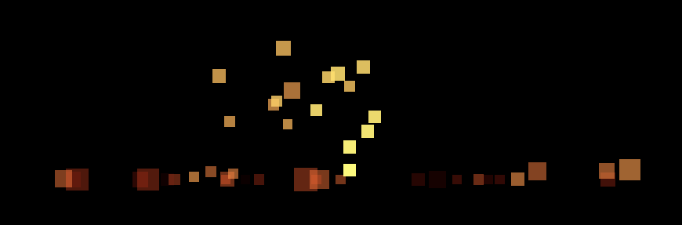

---

## Contents

- [Overview](#overview)
- [Particle System](#particle-system)
- [Intersections](#intersections)
- [Final Touches](#final-touches)

---

## Introduction

### Overview

In this chapter we will implement a _particle system_ that can be configured to support multiple scenarios, such as falling snow, smoke, explosions, etc.
This will build on the point-cloud and geometry shader functionality introduced in the previous chapter.

TODO - software vs hardware

### Requirements

To determine some requirements and constraints for what is considered to be a particle system we sketched a few scenarios and tried to identify some common properties:

scenario    | generation    | emitter   | trajectory    | forces        | bounds            | rendering         |
--------    | ----------    | -------   | ----------    | ----------    | ------            | ---------         |
snow        | constant      | box       | down          | breeze        | stick, time       | texture           |
fountain    | constant      | point     | ballistic     | gravity       | time              | blue              |
sparks      | periodic      | point     | ballistic     | gravity       | bounces, time     | colour fade       |
smoke       | constant      | box       | up            | n/a           | time              | colour fade       |
explosion   | once          | sphere    | expanding     | n/a           | time              | colour fade       |
fireworks   | periodic      | point     | ballistic     | gravity       | time              | colour            |

Where:

* A _ballistic_ trajectory is for particles that are 'fired' from a cone and generally implies a gravitational influence.

* The _bounds_ column specifies whether particles have a finite lifetime and/or are constrained by some geometric surface.

* A _colour fade_ indicates that the particle colour would fade over time, e.g. smoke particles would perhaps start as grey and fade to black.

From the above the following requirements can be derived:

* Particles are generated according to a configurable policy, either a one-off allocation or replenished per-frame.

* New particles are generated by an emitter.

* Particles follows a trajectory and are subject to influences, e.g. gravity, breeze, etc.

* Particles optionally have a finite lifetime.

* The particle system specifies geometric surfaces (or terrain) where particles are either stopped, destroyed, or reflected (e.g. sparks would bounce a bit).

* Particles have a colour which is either constant or fades over time.

### Design

For the particle system design we considered several alternative approaches (and there are almost certainly others) for how the _trajectory_ of a particle could be specified:

* A particle has a trajectory _function_ that calculates the position of the particle at a given instant (including any influences such as gravity, wind resistance, etc).

* The trajectory is computing in the shader.

* A particle comprises an initial position and movement vector, both of which are mutable.  The movement vector is applied to the particle position on each frame to simulate a trajectory.

There are pros and cons to all of these approaches:

* A trajectory function is appealing in that it encapsulates all the information about how that particle moves over time.  It is therefore simpler to comprehend, reusable, largely immutable, and easier to test in isolation.

* Delegating the trajectory to the shader is logical and almost certainly much more efficient, however this would be very difficult to test or to diagnose.  Additionally GLSL code would have to be cut-and-pasted rather than comprised of coherent, tested components (unless we employed some clever shader generator).

* Mutable particles and movement vectors are probably simpler to implement but slightly more complex to configure.

* A configurable particle system lends itself to being specified later by some configuration file (e.g. an XML document).

After some trials we opted for the simplest approach using mutable particles and influence vectors.

Particle system functionality will be progressively built using the _sparks_ scenario as a test case as this covers the majority of the identified requirements.

---

## Particle System

### Framework

The logical starting point is the definition of a _particle_ which is a mutable type:

```java
public class Particle {
    private final long time;
    private Point pos;
    private Vector dir;
    private Colour col = Colour.WHITE:

    public void move(Vector vec) {
        pos = pos.add(vec);
    }

    public void add(Vector vec) {
        dir = dir.add(vec);
    }
}
```

The _particle system_ is a controller implemented as an animation:

```java
public class ParticleSystem implements Frame.Listener {
    private PositionFactory pos = PositionFactory.ORIGIN;
    private VectorFactory vec = VectorFactory.of(Axis.Y);
    private final List<Particle> particles = new ArrayList<>();
    private int max = 1;
}
```

The two configurable factories specify the _emitter_ of the particle system, where the _position factory_ initialises the starting position of new particles:

```java
@FunctionalInterface
public interface PositionFactory {
    /**
     * @return Particle position
     */
    Point position();

    /**
     * Origin factory.
     */
    PositionFactory ORIGIN = of(Point.ORIGIN);

    /**
     * Creates a position factory at the given point.
     * @param pos Position
     * @return Literal position factory
     */
    static PositionFactory of(Point pos) {
        return () -> pos;
    }
}
```

And the _vector factory_ initialises the movement vector:

```java
@FunctionalInterface
public interface VectorFactory {
    /**
     * Generates the initial particle movement vector.
     * @return Movement vector
     */
    Vector vector();

    /**
     * Creates a factory with a fixed initial vector.
     * @param vec Movement vector
     * @return Literal vector factory
     */
    static VectorFactory of(Vector vec) {
        return () -> vec;
    }
}
```

These interfaces provide factory methods for literal positions and vectors, more specialised implementations will be added as the demo progresses.

New particles can now be programatically added to the system:

```java
public void add(int num, long time) {
    int actual = Math.min(num, max - size());
    for(int n = 0; n < actual; ++n) {
        Point start = pos.position();
        Vector dir = vec.vector();
        Particle p = new Particle(time, start, dir);
        particles.add(p);
    }
}
```

On a frame update the position of each particle is moved by its current direction:

```java
@Override
public boolean update(Animator animator) {
    float elapsed = animator.elapsed() / 1000f; // TODO
    for(Particle p : particles) {
        Vector vec = p.direction().multiply(elapsed);
        p.move(vec);
    }
    return false;
}
```

Note that the _elapsed_ duration is scaled to milliseconds-per-second, i.e. the movement vector is assumed to be expressed as a _velocity_ in seconds.

### Model

To render the particles the following model implementation is essentially an adapter for the particle system:

```java
public class ParticleModel extends AbstractModel {
    private final ParticleSystem sys;

    public ParticleModel(ParticleSystem sys) {
        super(Primitive.POINTS, new Layout(Point.LAYOUT, Colour.LAYOUT));
        this.sys = notNull(sys);
    }

    @Override
    public int count() {
        return sys.size();
    }

    @Override
    public ByteSizedBufferable vertices() {
        return vertices;
    }
}
```

Where the vertex buffer comprises the particles positions:

```java
private final ByteSizedBufferable vertices = new ByteSizedBufferable() {
    @Override
    public int length() {
        return sys.size() * LAYOUT.stride();
    }

    @Override
    public void buffer(ByteBuffer bb) {
        for(Particle p : sys.particles()) {
            p.buffer(bb);
        }
    }
};
```

Where the `buffer` method of the particle outputs the position and colour:

```java
void buffer(ByteBuffer bb) {
    pos.buffer(bb);
    col.buffer(bb);
}
```

### Influences

With a basic framework in place we can now introduce further functionality for the various particle system use-cases outlined above.

An _influence_ modifies some property of the particles on each frame: 

```java
public interface Influence {
    /**
     * Applies this influence to the given particle.
     * @param p             Particle to influence
     * @param elapsed       Elapsed scalar
     */
    void apply(Particle p, float elapsed);
}
```

The simplest implementation simulates an acceleration (e.g. gravity) by modifying the particle movement vector:

```java
static Influence of(Vector vec) {
    return (p, elapsed) -> p.add(vec.multiply(elapsed));
}
```

Influences are applied on each `update` by the following helper:

```java
private void influence(Particle p, float elapsed) {
    for(Influence inf : influences) {
        inf.apply(p, elapsed);
    }
}
```

### Generation

To bound a particle system an optional `lifetime` property is added and expired particles are removed at the start of the `update` method:

```java
if(lifetime < Long.MAX_VALUE) {
    long expired = animator.time() - lifetime;
    particles.removeIf(p -> p.time() < expired);
}
```

In most cases the particle system will be required to generate new particles on each frame, which is configured by the following policy:

```java
public interface GenerationPolicy {
    /**
     * Determines the number of particles to add on each frame.
     * @param current       Current number of particles
     * @param elapsed       Elapsed modifier
     * @return New particles to generate
     */
    int count(int current, float elapsed);

    /**
     * Policy for a particle system that does not generate new particles.
     */
    GenerationPolicy NONE = (current, elapsed) -> 0;
}
```

A basic policy factory is provided for a fixed number of particles:

```java
static GenerationPolicy fixed(int num) {
    return (current, elapsed) -> num - current;
}
```

The following more specialised implementation increments the number of particles:

```java
public class IncrementGenerationPolicy implements GenerationPolicy {
    private final float inc;
    private float pending;
}
```

The `actual` number of particles to generate is integral and `pending` accumulates fractional results between each frame:

```java
public int count(int current, float elapsed) {
    // Accumulate particles to generate
    pending += inc * elapsed;

    // Determine actual number of particles to generate
    int actual = (int) pending;
    pending -= actual;

    return actual;
}
```

A new step is added to the end of the `update` method to generate new particles according to the configured policy:

```java
void generate(float elapsed) {
    int num = policy.count(size(), elapsed);
    if(num > 0) {
        add(num, time);
    }
}
```

### Cone Emitter

Scenarios that involve ballistic trajectories require an emitter that randomises a direction within a cone.

First a new utility class is introduced that wraps a `Random` instance:

```java
public class Randomiser {
    private final Random random;

    public float next() {
        return random.nextFloat();
    }
}
```

This allows code dependant on RNG to be more effectively unit-tested since the `Random` class cannot be easily mocked.

The vector factory to generate a cone is specified as follows:

```java
public class ConeVectorFactory implements VectorFactory {
    private final Vector normal;
    private final Vector x, y;
    private final Interpolator radius;
    private final Randomiser random;
}
```

The `x` and `y` class members define a local coordinate system that is initialised in the constructor:

```java
public ConeVectorFactory(Vector normal, float radius, Randomiser random) {
    this.normal = notNull(normal);
    this.x = normal.cross(Axis.minimal(normal));
    this.y = x.cross(normal);
    this.radius = Interpolator.linear(-radius, +radius);
    this.random = notNull(random);
}
```

Where `minimal` selects an axis corresponding to the _minimum component_ of the normal, which is used to generate a vector orthogonal to the cone:

```java
private static Axis minimal(Vector normal) {
    if(normal.x < normal.y) {
        return normal.x < normal.z ? Axis.X : Axis.Z;
    }
    else {
        return normal.y < normal.z ? Axis.Y : Axis.Z;
    }
}
```

To generate vectors within the cone the normal is randomly rotated about each of the two axes:

```java
protected Vector rotate(Vector axis) {
    float angle = radius.interpolate(random.next());
    var rot = new AxisAngle(axis, angle);
    return rot.rotate(normal);
}
```

And the results are combined:

```java
public Vector vector() {
    Vector dx = rotate(x);
    Vector dy = rotate(y);
    return dx.add(dy).normalize();
}
```

The `rotate` method is added to the `Rotation` interface and implemented in the axis-angle class using _Rodrigues' rotation formula_ as follows:

```java
@Override
public Vector rotate(Vector vec) {
    float cos = MathsUtil.cos(angle);
    Vector a = vec.multiply(cos);
    Vector b = axis.cross(vec).multiply(MathsUtil.sin(angle));
    Vector c = axis.multiply((1 - cos) * axis.dot(vec));
    return a.add(b).add(c);
}
```

This algorithm offers an alternative to matrix or quaternion rotations and may be more efficient in certain use-cases.

### Integration

The application for the _sparks_ demo is cloned from the previous project and a new configuration class is added to initialise the particle system:

```java
@Configuration
public class ParticleSystemConfiguration {
    private final ApplicationConfiguration cfg;
    private final ParticleSystem sys;
    private final Mesh mesh;
    private final Player player;

    @Bean
    public Player player() {
        player.play();
        return player;
    }

    @Bean
    public Mesh mesh() {
        return mesh;
    }
}
```

The particle system, model and animator are instantiated in the constructor:

```java
public ParticleSystemConfiguration() {
    this.sys = system();
    this.player = new Player(sys);
    this.mesh = sys.mesh();
}
```

The particle system periodically emits a relatively small number of particles per second in a randomised cone:

```java
private static ParticleSystem system() {
    var sys = new ParticleSystem();
    sys.policy(new IncrementGenerationPolicy(10, 100));
    sys.lifetime(5000L);
    sys.direction(new ConeDirectionFactory(Axis.Y, 1, new Randomiser()));
    return sys;
}
```

Next the vertex buffer for the particles is created:

TODO - move

```java
@Bean
public VertexBuffer vbo(LogicalDevice dev) {
    var props = new MemoryProperties.Builder<VkBufferUsageFlag>()
        .usage(VkBufferUsageFlag.VERTEX_BUFFER)
        .required(VkMemoryProperty.HOST_VISIBLE)
        .required(VkMemoryProperty.HOST_COHERENT)
        .optimal(VkMemoryProperty.DEVICE_LOCAL)
        .build();

    int len = sys.max() * Point.LAYOUT.length();
    VulkanBuffer buffer = VulkanBuffer.create(dev, len, props);
    return new VertexBuffer(buffer);
}
```

Note that the buffer is sized to the maximum number of particles.

The particle system is written to the VBO on each frame:

```java
@Bean
public Frame.Listener update(VertexBuffer vbo) {
    return () -> {
        Region region = vbo.memory().map();
        ByteBuffer bb = region.buffer();
        model.vertices().buffer(bb);
        region.unmap();
    };
}
```

The only other modification is in the render configuration where the draw command is created on __each__ frame since the model is now dynamic:

```java
TODO
```

For the moment the fragment shader is a simple pass-through implementation that ignores the generated texture coordinates:

```glsl
#version 450

layout(location=0) in vec2 inCoords;
layout(location=1) in vec4 inColour;

layout(location=0) out vec4 outColour;

void main() {
    outColour = inColour;
}
```

Notes:

* The particle colour is hard-coded to a flat yellow colour.

* The vertex and geometry shaders are unchanged from the previous project.

If all goes well we should see a fountain of yellow quads when running the particle system:


---

## Intersections

### Rays

To support particle collisions we introduce _ray intersections_ where a _ray_ is defined as a vector relative to an origin:

```java
public interface Ray {
    Point origin();
    Normal direction();
    float length();
}
```

Where `length` specifies the end point of the ray (which can be infinite).

Next a new abstraction defines some arbitrary geometry that can be _intersected_ by a ray:

```java
public interface Intersected {
    /**
     * Determines the intersections of this surface with the given ray.
     * @param ray Ray
     * @return Intersections
     */
    Iterable<Intersection> intersections(Ray ray);

    /**
     * Empty result.
     */
    Iterable<Intersection> NONE = List.of();
}
```

Where an _intersection_ specifies a point on the ray and an optional surface normal:

```java
public interface Intersection {
    /**
     * @return Intersection distance along the ray
     */
    float distance();

    /**
     * Calculates the intersection point on the ray, i.e. solves the line equation for the intersection distance.
     * @return Intersection point
     */
    Point point();

    /**
     * Surface normal at this intersection.
     * @return Surface normal
     * @throws UnsupportedOperationException if the normal is undefined
     */
    default Normal normal() {
        throw new UnsupportedOperationException();
    }
}
```

Which is partially implemented by the following skeleton:

```java
abstract class AbstractIntersection implements Intersection {
    private final Ray ray;
    private final float dist;
    private Point pos;

    @Override
    public final Point point() {
        if(pos == null) {
            Point origin = ray.origin();
            Normal dir = ray.direction();
            pos = origin.add(dir.multiply(dist));
        }
        return pos;
    }
}
```

The rationale for this rather elaborate API is to allow intersections, and particularly surface normals, to be lazily evaluated for a variety of reasons:

* As will be seen later, the process of determining intersections with a surface generally requires computationally expensive code (such as square roots) where the logic to calculate the _number_ of intersections and their positions is often inter-related.  Hence the intersection results are expressed as an `Iterable` where calculation of the results can be deferred as required.

* Calculation of the actual intersection distance (and surface normal) can often be ignored altogether.  For example a collision surface defined to destroy intersected particles only needs to know _whether_ an intersection occurs and not where.

* Surface normals are irrelevant for many use cases, e.g. scene picking.

### Planes

The simplest collision surface implementation is a _plane_ defined by a normal and a distance from the origin:

```java
public record Plane(Normal normal, float distance) implements Intersected
```

In addition to the canonical constructor a plane can be specified by the normal and a point on the plane:

```java
public Plane(Normal n, Point p) {
    this(n, -n.dot(p));
}
```

Finally a plane can be constructed from a triangle of points lying in the plane:

```java
public static Plane of(Point a, Point b, Point c) {
    Vector u = Vector.between(a, b);
    Vector v = Vector.between(a, c);
    Normal normal = u.cross(v).normalize();
    return new Plane(normal, a);
}
```

The standard ray-plane intersection algorithm is implemented as follows:

```java
public Iterator<Intersection> intersections(Ray ray) {
    // Calc denominator
    float denom = normal.dot(ray.direction());

    // Stop if parallel
    if(MathsUtil.isZero(denom)) {
        return NONE;
    }

    // Calc intersection
    float d = -distance(ray.origin()) / denom;
    if((d < 0) || (d > ray.length()) {
        return NONE;
    }

    // Build intersection
    return Intersection.of(ray, d, normal);
}
```

Where `distance` calculates the distance of a given point from the plane:

```java
public float distance(Point p) {
    return normal.dot(p) + distance;
}
```

### Collisions

Particle collisions are configured by an intersecting surface and an associated collision function:

```java
private final Map<Intersected, Collision> surfaces = new HashMap<>();
```

The particle class is modified to implement the new `Ray` abstraction and can now be tested for collisions:

```java
private void collide(Particle p) {
    for(var entry : surfaces.entrySet()) {
        Intersected surface = entry.getKey();
        Iterator<Intersection> itr = surface.intersections(p).iterator();
        if(itr.hasNext()) {
            Collision collision = entry.getValue();
            collision.collide(p, itr.next());
            break;
        }
    }
}
```

A `Collision` defines the operation to be performed on the intersected particle:

```java
public interface Collision {
    /**
     * Applies this collision to the given particle.
     * @param p                 Particle
     * @param intersection      Intersection
     */
    void collide(Particle p, Intersection intersection);
    
    /**
     * Destroys a collided particle.
     */
    Collision DESTROY = (p, __) -> p.destroy();

    /**
     * Stops a collided particle at the given intersection.
     */
    Collision STOP = (p, intersection) -> {
        Point pos = intersection.point();
        p.stop(pos);
    };
}
```

A destroyed particle is signalled by a `null` position:

```java
public boolean isAlive() {
    return pos != null;
}

void destroy() {
    pos = null;
}
```

And similarly for a particle that has been stopped:

```java
public boolean isIdle() {
    return dir == null;
}

void stop(Point pos) {
    this.pos = notNull(pos);
    this.dir = null;
}
```

### Reflection

The slightly more involved reflection case is factored out to a new collision implementation:

```java
public class ReflectionCollision implements Collision {
    private final float absorb;
}
```

Where `absorb` is an optional absorption factor applied on a collision, e.g. to _dampen_ the velocity in the sparks demo.

The particle is reflected about the first intersection point and the absorption factor is applied to the reflected direction:

```java
@Override
public void collide(Particle p, Intersection intersection) {
    Point pos = intersection.point();
    Normal normal = intersection.normal();
    p.reflect(pos, normal);
    p.velocity(absorb);
}
```

This method delegates to a new particle mutator:

```java
public void reflect(Point pos, Normal normal) {
    this.pos = notNull(pos);
    this.dir = dir.reflect(normal);
}
```

Which in turn delegates to a new method on the vector class to reflect about a given normal:

```java
public Vector reflect(Normal normal) {
    float f = -2f * normal.dot(this);
    return normal.multiply(f).add(this);
}
```

Note that as things stand this approach simply moves the particle to the intersection point and reflects the movement vector.  This may produce poor results for large elapsed durations since the distance travelled (or remaining) is not taken into account.

The demo is modified by the introduction of an influence to simulate gravity and a collision surface representing the ground:

```java
private static ParticleSystem system(ApplicationConfiguration cfg) {
    ...
    sys.add(Influence.of(Axis.Y.invert()));
    sys.add(new Plane(Axis.Y, 0), Collision.STOP);
    return sys;
}
```

The particles should now stick to the ground:


Finally the collision surface is modified to reflect particles with a dampening absorption factor on each 'bounce':

```java
sys.add(new Plane(Axis.Y, 0), new ReflectionCollision(0.3f));
```

---

## Final Touches

### Optimisation

Before progressing any further there are several issues with the existing code:

* Destroyed particles are removed using `removeAll` which is extremely inefficient for this scenario, especially for large numbers of particles.

* The time and elapsed parameters have to be passed around the various methods and lambdas, making the code somewhat messy.

* Ideally the process would employ parallel streams rather than imperative, single-threaded loops.

* Some of the steps are optional, e.g. not all particle systems have a lifetime.

First the `update` method is refactored making the steps and dependencies more explicit:

```java
@Override
public void update(Animator animator) {
    long time = animator.frame().time().toEpochMilli();
    float elapsed = animator.elapsed() * SCALE;
    expire(time);
    update(time, elapsed);
    cull();
    generate(time, elapsed);
}
```

Where `SCALE` modifies the elapsed duration to seconds-per-frame:

```java
private static final float SCALE = 1f / TimeUnit.SECONDS.toMillis(1);
```

Expired particles are _marked_ as destroyed as a parallel stream operation:

```java
private void expire(long time) {
    long expired = time - lifetime;

    particles
        .parallelStream()
        .filter(p -> p.time() < expired)
        .forEach(Particle::destroy);
}
```

The update step is also refactored as a parallel operation:

```java
private void update(float elapsed) {
    Instance instance = new Instance();
    particles
        .parallelStream()
        .filter(Particle::isAlive)
        .filter(Predicate.not(Particle::isIdle))
        .forEach(instance::update);
}                
```

Where `Instance` is a local class comprising the existing update logic that also captures the `elapsed` duration parameter to simplify the code:

```java
class Instance {
    private void update(Particle p) {
        influence(p);
        move(p);
        collide(p);
    }

    ...
}
```

Particles that have been destroyed (either by lifetime expiration or a collision) are culled in the final step:

```java
private void cull() {
    particles = particles
        .parallelStream()
        .filter(Particle::isAlive)
        .collect(toCollection(ArrayList::new));
}
```

Note that the reference to the `particles` collection is now mutable and is over-written by the `cull` method.

A final enhancement is the introduction of the the `Characteristic` enumeration that allows the application to provide hints to the particle system.  The `DISABLE_CULLING` characteristic skips the `expire` and `cull` steps (not shown) for a particle system where particles exist indefinitely.

The particle system is now much cleaner and employs multiple processor cores.

### Emitters

Several scenarios require an emitter defined as a box (or rectangle) which is implemented by a new type specified by min-max extents:

```java
public record Bounds(Point min, Point max) {
    public Point centre() {
        return min.add(max).multiply(MathsUtil.HALF);
    }
}
```

Particles can now be randomly generated within a given box:

```java
static PositionFactory box(Bounds box, Randomiser randomiser) {
    Point centre = box.centre();
    Vector range = Vector.between(box.min(), box.max()).multiply(MathsUtil.HALF);
    return () -> {
        Vector vec = randomiser.vector().multiply(range);
        return new Point(vec).add(centre);
    };
}
```

Using a new method on the `Randomiser` class:

```java
public class Randomiser {
    ...
    private final float[] array = new float[3];
    private final Interpolator interpolator = Interpolator.linear(-1, +1);

    public Vector vector() {
        for(int n = 0; n < array.length; ++n) {
            array[n] = interpolator.interpolate(next());
        }
        return new Vector(array);
    }
}
```

Where `multiply` is a new method on the the vector class that performs a component-wise multiplication.

The final emitter implementation generates particles on the surface of a sphere:

```java
static PositionFactory sphere(Sphere sphere, Randomiser randomiser) {
    return () -> {
        Vector vec = randomiser.vector().normalize().multiply(sphere.radius());
        return sphere.centre().add(vec);
    };
}
```

Where `Sphere` is a simple tuple for a centre point and a radius.

### Colour Fade

The final outstanding requirements for the sparks demo is animation of the colour and particle textures.

First a further configurable property is added to the particle system to determine the colour of a particle depending on its age:

```java
@FunctionalInterface
public interface ColourFactory {
    /**
     * Determines the colour of a particle.
     * @param t Elapsed scalar
     * @return Particle colour
     */
    Colour colour(float t);

    /**
     * @return Whether the particle colour is modified on each frame
     */
    default boolean isModified() {
        return true;
    }
}
```

A constant colour is specified via a factory method:

```java
static ColourFactory of(Colour col) {
    return new ColourFactory() {
        @Override
        public Colour colour(float __) {
            return col;
        }

        @Override
        public boolean isModified() {
            return false;
        }
    };
}
```

Which is applied once when particles are generated in the `add` method of the particle system:

```java
if(!colour.isModified()) {
    Colour col = colour.colour(0);
    for(Particle p : added) {
        p.colour(col);
    }
}
```

A second implementation interpolates a colour over the lifetime of the particle:

```java
static ColourFactory interpolated(Colour start, Colour end) {
    return t -> start.interpolate(end, t);
}
```

Which delegates to a new interpolator in the colour class:

```java
public Colour interpolate(Colour col, float t) {
    float[] start = this.toArray();
    float[] end = col.toArray();
    for(int n = 0; n < start.length; ++n) {
        start[n] = Interpolator.interpolate(t, start[n], end[n]);
    }
    return of(start);
}
```

The colour factory is configured as follows in the demo:

```java
sys.colour(ColourFactory.interpolated(new Colour(1, 1, 0.5f, 1), new Colour(0.5f, 0, 0, 0)));
```

Particles should now start off bright white-yellow and fade through red to black:



Note that colour blending is disabled in the pipeline.

### Configuration

Ideally we would like to demonstrate the various particle system scenarios by parameterising the project rather than creating multiple applications, i.e. specify the particle system and shader parameters via configuration files and implement some sort of switch at run-time.

First a new loader is implemented to specify a particle system via a configuration file:

```java
public class ParticleSystemLoader implements ResourceLoader<Element, ParticleSystem> {
    private final ElementLoader loader = new ElementLoader();
    private final Randomiser randomiser;

    @Override
    public Element map(InputStream in) throws IOException {
        return loader.load(new InputStreamReader(in));
    }

    @Override
    public ParticleSystem load(Element root) throws IOException {
        ...
    }
}
```

An `Element` is a custom library type representing a node in a nested configuration file such as an XML, JSON or YAML document.  This class is largely out-of-scope for this blog, but in summary an element is used to:

* Process a document by recursively walking the node tree.

* Extract text and attributes from an element.

* Transform element content to Java primitives.

Converters are introduced for common data types (point, vector, colour, etc) and a specialised implementation is added to the `Axis` class (not shown) that allows a vector to be specified as a comma-delimited tuple or a cardinal axis, e.g. `X` or `-X`.

Loaders are implemented for the built-in types used in the particle system, for example:

```java
public static SpherePositionFactory load(Element e, Randomiser randomiser) {
    Point centre = e.child("centre").text().transform(Point.CONVERTER);
    float radius = e.child("radius").text().toFloat();
    var sphere = new Sphere(centre, radius);
    return new SpherePositionFactory(sphere, randomiser);
}
```

These methods are registered with the `ParticleSystemLoader` class to support the various emitters, colour factories, etc. which also allows custom implementations to be plugged in if required.

In this case an XML document seems the most appropriate format to configure the particle system:

```xml
<sparks>
    <max>50</max>
    <policy>
        <increment>10</increment>
    </policy>
    <lifetime>5s</lifetime>
    <position>
        <origin />
    </position>
    <vector>
        <cone>
            <normal>Y</normal>
            <radius>1</radius>
        </cone>
    </vector>
    <colour>
        <interpolated>
            <start>1, 1, 0.5, 1</start>
            <end>0.5, 0, 0, 0</end>
        </interpolated>
    </colour>
    <influences>
        <literal>-Y</literal>
    </influences>
    <surfaces>
        <reflect>
            <plane>
                <normal>Y</normal>
                <distance>0</distance>
            </plane>
            <absorb>0.3</absorb>
        </reflect>
    </surfaces>
</sparks>
```

A Spring _profile_ is used to switch between scenarios configured by a JVM argument:

```java
-Dspring.profiles.active=sparks
```

The profile is injected into the loader to select the scenario-specific configuration file for the particle system:

```java
public ParticleSystemConfiguration(@Value("${spring.profiles.active}") String profile, ...) {
    this.sys = loader.load(profile + ".xml");
    ...
}
```

The `application.properties` is modified to separate the configuration for each scenario as appropriate, as illustrated in the following fragment:

```java
dataDirectory: workspace/Demo/Data
frameCount: 2
features: geometryShader
size: 0.025
shader: particle
texture: particle.png

#---
spring.config.activate.on-profile=sparks
title: Particle System - Sparks
texture: spark.png

#---
spring.config.activate.on-profile=snow
title: Particle System - Snow
size: 0.5
texture: snow.png
```

Notes:

* The first section specifies properties that are common to all profiles.

* The _size_ property is injected into the relevant shaders as a specialisation constant.

A new configuration property is added to specify the fragment shader:

```java
@Bean
Shader fragment(ApplicationConfiguration cfg) {
    return shader(String.format("%s.frag", cfg.getShader()));
}
```

And finally the specified texture is loaded and mixed with the particle colour in the fragment shader:

```glsl
#version 450

layout(binding=1) uniform sampler2D Sampler;

layout(location=0) in vec2 inCoords;
layout(location=1) in vec4 inColour;

layout(location=0) out vec4 outColour;

void main() {
    outColour = inColour * texture(Sampler, inCoords);
}
```

The demo can now be used to run all the scenarios switched by the application argument.  Sweet.

Generally a Spring profile is used to parameterise the configuration of bean components.  The profile could (for example) only load the texture and create a sampler for certain scenarios, but this is not particularly relevant for this demo.

---

## Summary

In this chapter a configurable particle system was implemented with support for planes and ray intersections.
