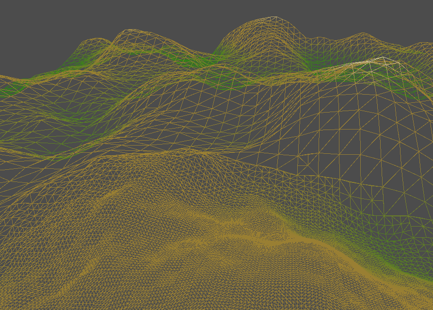

---

## Contents

- [Overview](#overview)
- [Terrain Grid](#terrain-grid)
- [Tesselation](#tesselation)
- [Integration](#integration2)

---

## Overview

During the course of this blog we have implemented the majority of the basic Vulkan components that would be used by most applications, and have reached the end of the Vulkan tutorial.  From here on we will be implementing more advanced features such as lighting, shadows, etc.

Later we will also address the complexity caused by the number of objects that are currently required to render each element of a scene (descriptor sets, render sequences, pools, etc) by the introduction of a _scene graph_ and supporting framework.

In this first chapter we will start a new demo to render a terrain model derived from a height-map image, and then implement level of detail (LOD) functionality for the grid mesh using a _tesselation_ shader.

This will require the following new components:

* A model builder for a terrain grid.

* The tesselation pipeline stage.

* A new method to lookup pixel data from a height-map image.

In the following chapter we will implement various enhancements to the pipeline and shader framework.

The shader code in this chapter is heavily based on the Vulkan Cookbook and the [Vulkan Samples](https://github.com/KhronosGroup/Vulkan-Samples/blob/master/samples/api/terrain_tessellation) example.

---

## Terrain Grid

### Grid Builder

Before we introduce tesselation we will first render a static terrain model as a baseline for the demo application.

We start with a new model builder that constructs a _grid_ of _quads_ in the X-Z plane:

```java
public class GridBuilder {
    private Dimensions size = new Dimensions(4, 4);
    private float tile = 1;
    private HeightFunction height = HeightFunction.literal(0);
    private Primitive primitive = Primitive.TRIANGLES;
    private IndexFactory index;

    public Mesh build() {
        ...
    }
}
```

Where:

* _size_ is the dimensions of the grid, i.e. the number of vertices in each direction.

* _tile_ is the dimensions of each quad comprising the grid.

* And _height_ generates the height (Y coordinate) of each vertex.

* The purpose of the `IndexFactory` is covered below.

The _height function_ is a simple interface that determines the height of a grid vertex:

```java
@FunctionalInterface
public interface HeightFunction {
    /**
     * Calculates the height at the given coordinates.
     * @param row Row
     * @param col Column
     * @return Height
     */
    float height(int x, int y);
}
```

A default implementation is provided for a constant value:

```java
static HeightFunction literal(float height) {
    return (x, y) -> height;
}
```

Note that this implementation is used to initialise the height of all vertices to zero by default.

The builder first initialises the grid mesh:

```java
public Mesh build() {
    final var mesh = new IndexedMesh(primitive, new CompoundLayout(Point.LAYOUT, Coordinate2D.LAYOUT));
    ...
    return mesh;
}
```

The mesh is centred on the origin of the grid so the _half distances_ of the vertices are calculated relative to the centre:

```java
int w = size.width();
int h = size.height();
float dx = tile * (w - 1) / 2;
float dz = tile * (h - 1) / 2;
```

Next the code iterates through the grid to generate the vertices (in column major order):

```java
for(int row = 0; row < h; ++row) {
    for(int col = 0; col < w; ++col) {
        ...
    }
}
```

The position and height of each vertex is determined as follows:

```java
float x = col * tile - dx;
float z = row * tile - dz;
float y = height.height(col, row);
Point pos = new Point(x, y, z);
```

And the texture coordinate is simply mapped from the row and column indices:

```java
Coordinate coord = new Coordinate2D((float) col / w, (float) row / h);
```

Finally each vertex is added to the model:

```java
Vertex vertex = vertex(pos, coord);
mesh.add(vertex);
```

### Index Factory

To generate the index for the model the following factory abstraction is introduced:

```java
@FunctionalInterface
public interface IndexFactory {
    /**
     * Generates the indices for a quad strip.
     * @param width Strip width
     * @return Strip indices
     */
    IntStream indices(int width);
}
```

The following constant generates an index for a quad strip comprised of triangles:

```java
IndexFactory TRIANGLES = width -> IntStream
    .range(0, width)
    .flatMap(n -> triangles(n, width));
```

Which delegates to the following helper to generates two triangles per quad with a counter-clockwise winding order:

```java
static IntStream triangles(int index, int width) {
    int next = index + 1;
    int bottom = index + width + 1;
    return IntStream.of(
        index, bottom, next,
        bottom, bottom + 1, next
    );
}
```

An index can also be implemented as a triangle-strip:

```java
IndexFactory TRIANGLE_STRIP = width -> IntStream
    .rangeClosed(0, width)
    .flatMap(n -> IntStream.of(n, n + width + 1));
```

In the builder the index for the model is generated via the configured factory:

```java
IntStream
    .range(0, h - 1)
    .flatMap(row -> index.row(row, w - 1))
    .forEach(model::add);
```

Which uses the following adapter to generate a strip for each row of the grid:

```java
default IntStream row(int row, int width) {
    final int start = row * width;
    return indices(width).map(n -> n + start);
}
```

Since the index buffer for the grid will often be relatively small this is a good opportunity to implement _short_ index buffers.

First the following helper is added to the indexed mesh class to determine the type of index based on the draw count:

```java
public IndexedMesh {
    /**
     * Size of a {@code short} index.
     */
    private static final long SHORT_INDEX = MathsUtil.unsignedMaximum(Short.SIZE);

    /**
     * Determines whether the given draw count requires a {@code int} index.
     * i.e. Whether the number of indices is larger than a {@code short} value.
     * @param count Draw count
     * @return Whether the index data type is integral
     */
    public static boolean isIntegerIndex(int count) {
        return count >= SHORT_INDEX;
    }
}
```

The length of the index buffer is then calculated based on the appropriate component type:

```java
private class IndexBuffer implements ByteSizedBufferable {
    public int length() {
        int size = index.size();
        int bytes = isIntegerIndex(size) ? Integer.BYTES : Short.BYTES;
        return size * bytes;
    }
}
```

And finally the `buffer` method is modified (not shown) to copy the index to the hardware as short or integer values accordingly.

### Height Maps

To generate height data for the terrain grid we will load a _height map_ image.  Although the height of a given vertex can easily be sampled from the image there are several cases where an application will need to programatically 'sample' the height-map, e.g. to generate surface normals.

Therefore we essentially emulate a texture sampler by implementing a height function that looks up a pixel from an image.  In any case the image class should support the ability to retrieve pixel data for other use cases.

The height-map function is created using a new factory method:

```java
/**
 * Creates a height function based on a height-map image (i.e. equivalent to a texture sampler).
 * @param size          Grid dimensions
 * @param image         Image
 * @param component     Component channel index for height values
 * @param scale         Height scalar
 * @return Image height function
 * @throws IllegalArgumentException if the component index is invalid for the given image
 */
static HeightFunction heightmap(Dimensions size, ImageData image, int component, float scale) {
}
```

This function first maps the grid dimensions to those of the image:

```java
Dimensions dim = image.extents().size();
float w = dim.width() / size.width();
float h = dim.height() / size.height();
```

Next a scalar is calculated to normalise and scale the pixel values:

```java
float normalise = scale / MathsUtil.unsignedMaximum(Byte.SIZE * image.layout().bytes());
```

Where `unsignedMaximum` calculates the maximum unsigned integer value for a given number of bits:

```java
public static long unsignedMaximum(int bits) {
    return (1L << bits) - 1;
}
```

Finally the pixel coordinate is calculated and the method delegates to a new `pixel` method on the image class:

```java
return (row, col) -> {
    int x = (int) (col * w);
    int y = (int) (row * h);
    return image.pixel(x, y, component) * normalise;
};
```

The implementation of `pixel` for a KTX image is as follows:

```java
public int pixel(int x, int y, int component) {
    int offset = levels.get(0).offset;
    int start = (x + y * extents.size.width()) * layout.length();
    int index = offset + start + (component * layout.bytes());
    return LittleEndianDataInputStream.convert(image, index, layout.bytes());
}
```

Note that the pixel is retrieved from the _first_ MIP level (i.e. the 'full' image) and ignores any array layers.

Since KTX images are little-endian by default the pixel value is transformed using a new utility method:

```java
public static int convert(byte[] bytes, int offset, int len) {
    int value = bytes[offset] & MASK;
    for(int n = 1; n < len; ++n) {
        value = value | (bytes[offset + n] & MASK) << (n * 8);
    }
    return value;
}
```

Finally the KTX loader is improved to handle height-map images with one channel and/or multiple bytes per channel:

* The number of bytes in the image layout is derived from the samples section of the DFD (previously was assumed to be one byte).

* This value is validated against the `typeSize` from the header, which also implicitly ensures that __all__ channels have the same size.

* The format hint is fiddled to a normalised type since some of the images have an integral image format which is not supported by Vulkan samplers, e.g. `R16_UINT`

### Integration

In the new application the following is retained from the previous skybox demo:

* The essential Vulkan components (devices, swapchain, etc).

* The orbital camera controller.

* The uniform buffer for the three matrices.

* The rendering pipeline and render sequence for the model.

* The descriptor sets for the texture sampler.

First a simple, flat terrain grid is generated using the new builder:

```java
@Bean
public static Model model() {
    return new GridBuilder()
        .size(new Dimensions(64, 64))
        .scale(0.25f)
        .build();
}
```

The vertex shader is the same as the previous demos and the fragment shader simply generates a constant colour for all fragments.  This should render a flat plane since the height of each vertex is initialised to zero.

Next the height-map image is loaded and used to generate the terrain:

```java
@Bean
public static Model model(ImageData heightmap) {
    Dimensions size = new Dimensions(64, 64);
    return new GridBuilder()
        .size(size)
        .scale(0.25f)
        .height(GridBuilder.HeightFunction.heightmap(size, heightmap, 0))
        .build();
}
```

The fragment shader is also modified to sample the height-map for each generated vertex:

```glsl
#version 450

layout(binding=0) uniform sampler2D heightMap;
layout(location=0) in vec2 inCoord;
layout(location=0) out vec4 outColour;

void main() {
    outColour = texture(heightMap, inCoord);
}
```

Where the sampler is modified to clamp texture coordinates:

```java
public Sampler sampler() {
    return new Sampler.Builder()
        .wrap(VkSamplerAddressMode.CLAMP_TO_EDGE)
        .build(dev);
}
```

The demo should produce something along the lines of the following:


Note that height-map image is either a gray-scale (i.e. single colour channel) or an RGBA image, in either case the height function and sampler select the __first__ channel of the image (which is why the terrain is red in the image above).

---

## Tesselation

### Overview

Tesselation is the process of generating drawing primitives from an arbitrary geometric object known as a _patch_ which is comprised of a number of _control points_.

In the pipeline this is comprised of three stages:

1. A _tesselation control shader_ that is responsible for transforming patch control points and determining the _tesselation levels_ of the geometry.

2. The fixed-function _tesselator_ which generates multiple primitives by sub-dividing the patch according to the tesselation levels.

3. A _tesselation evaluation shader_ that transforms the vertices of the resultant tesselated geometry.

Note that tesselation is an optional pipeline stage, i.e. the tesselator is enabled when the pipeline contains both shaders.

In the demo we will generate a low-polygon terrain model and employ LOD tesselation to increase the number of vertices dependant on the distance to the camera.

### Terrain Model

The terrain model is a grid of _patches_ with an index specifying each quad of the terrain:

```java
IndexFactory QUADS = width -> IntStream
    .range(0, width)
    .flatMap(n -> quad(n, width));
```

Which uses the following helper to generate counter-clockwise indices for each quad in the strip:

```java
static IntStream quad(int index, int width) {
    int next = index + width + 1;
    return IntStream.of(index, next, next + 1, index + 1);
}
```

The model configuration class is modified to generate a grid of patches with quad control points:

```java
public static Model model() {
    return new GridBuilder()
        .size(new Dimensions(64, 64))
        .scale(0.25f)
        .primitive(Primitive.PATCH)
        .index(IndexFactory.QUADS)
        .build();
}
```

Note that the height function is removed so patch vertices will have a Y (or height value) of zero.

The vertex shader is now largely relegated to passing through the geometry to the tesselation stages:

```glsl
#version 450

layout(location=0) in vec3 inPosition;
layout(location=1) in vec2 inCoord;

layout(location=0) out vec2 outCoord;

void main() {
    gl_Position = vec4(inPosition, 1.0);
    outCoord = inCoord;
}
```

### Control Shader

The control shader determines the amount of tesselation to be performed by setting the built-in `gl_TessLevelInner` and `gl_TessLevelOuter` variables for _each_ control point.

Initially we configure the shader as a simple 'pass-through' implementation that leaves the tesselation levels as the default values:

```glsl
#version 450

layout(location=0) in vec2 inCoord[];

layout(vertices=4) out;

layout(location=0) out vec2 outCoord[4];

void main() {
    if(gl_InvocationID == 0) {
        gl_TessLevelInner[0] = 1.0;
        gl_TessLevelInner[1] = 1.0;
        gl_TessLevelOuter[0] = 1.0;
        gl_TessLevelOuter[1] = 1.0;
        gl_TessLevelOuter[2] = 1.0;
        gl_TessLevelOuter[3] = 1.0;
    }
    
    gl_out[gl_InvocationID].gl_Position = gl_in[gl_InvocationID].gl_Position;
    outCoord[gl_InvocationID] = inCoord[gl_InvocationID];
}
```

Notes:

* The `layout(vertices=4) out` declaration specifies the number of control points to be processed by the shader (a quad in this case).

* Note that this shader is executed for each control point but the tesselation levels are generally calculated once per patch, it is common practice to the wrap the calculation of the tesselation levels in a conditional statement using the built-in GLSL `gl_InvocationID` variable.

Configuration of the tesselation stage in the pipeline is very trivial:

```java
public class TesselationPipelineStageBuilder ... {
    private int points;

    @Override
    VkPipelineTessellationStateCreateInfo get() {
        if(points == 0) {
            return null;
        }

        var info = new VkPipelineTessellationStateCreateInfo();
        info.patchControlPoints = points;
        return info;
    }
}
```

### Evaluation Shader

After the fixed function tesselator stage has generated the geometry the evaluation shader is executed to transform each vertex of the tesselated primitives.

For the terrain demo the shader implementation will perform the following:

1. Interpolate the position and texture coordinate of the tesselated vertex.

2. Sample the height-map to determine the height of the vertex.

3. Apply perspective projection.

Note that obviously for this first attempt (with tesselation essentially disabled) the results of the interpolation should simply map one-to-one to the grid vertices.

The shader starts with a layout declaration that specifies the structure of the incoming geometry generated by the previous stages:

```glsl
layout(quads, equal_spacing, ccw) in;
```

This layout specifies that each patch is a quad with a counter-clockwise winding order (matching the index factory used above).  The purpose of the spacing argument is documented in [Tesselator Spacing](https://www.khronos.org/registry/vulkan/specs/1.0-wsi_extensions/html/chap22.html#tessellation-tessellator-spacing).

Next the shader declares the required resources and the input/output data:

```glsl
layout(location=0) in vec2 inCoords[];

layout(set=0, binding=0) uniform sampler2D heightMap;

layout(set=0, binding=1) uniform UniformBuffer {
    mat4 model;
    mat4 view;
    mat4 projection;
};

layout(location=0) out vec3 outPosition;
layout(location=1) out vec2 outCoord;
```

Note that the incoming texture coordinates are an _array_ of the four vertices of each quad.

The shader first interpolates the texture coordinate along the left and right-hand edges of each quad.  The indices in the terrain model have a counter-clockwise winding order, so for a quad with the following vertices and index:

```
A - B   0 - 3   
| / |   | / |   
C - D   1 - 2   
```

The left edge is A-C and the right-hand is B-D when viewed from above the terrain (i.e. the negative Y direction).  To ensure the resultant vertices have the correct winding order the interpolation is performed in the negative Z direction.  The two edges therefore map to indices 1,0 and 2,3 respectively.

The `mix` function performs this interpolation parameterised by the built-in `gl_TessCoord` texture coordinate generated by the tesselator:

```glsl
vec2 coords1 = mix(inCoords[1], inCoords[0], gl_TessCoord.x);
vec2 coords2 = mix(inCoords[2], inCoords[3], gl_TessCoord.x);
```

These values are then interpolated again in the other direction to calculate the final texture coordinate:

```glsl
vec2 coord = mix(coords1, coords2, gl_TessCoord.y);
```

The vertex position is interpolated similarly but in this case using the built-in `gl_in` positions array generated by the tesselator.

The height of each vertex is then sampled from the red channel of the height-map (as we did previously):

```glsl
pos.y += texture(heightMap, coord).r * 2.5;
```

And finally the shader applies perspective projection and outputs the resultant vertex:

```glsl
gl_Position = projection * view * model * pos;
```

The complete evaluation shader is as follows:

```glsl
#version 450

layout(quads, equal_spacing, ccw) in;

layout(location=0) in vec2 inCoord[];

layout(set=0, binding=0) uniform sampler2D heightMap;

layout(set=0, binding=1) uniform UniformBuffer {
    mat4 model;
    mat4 view;
    mat4 projection;
};

layout(location=0) out vec2 outCoord;

void main() {
    // Interpolate texture coordinate
    vec2 coords1 = mix(inCoord[1], inCoord[0], gl_TessCoord.x);
    vec2 coords2 = mix(inCoord[2], inCoord[3], gl_TessCoord.x);
    vec2 coord = mix(coords1, coords2, gl_TessCoord.y);

    // Interpolate position
    vec4 pos1 = mix(gl_in[1].gl_Position, gl_in[0].gl_Position, gl_TessCoord.x);
    vec4 pos2 = mix(gl_in[2].gl_Position, gl_in[3].gl_Position, gl_TessCoord.x);
    vec4 pos = mix(pos1, pos2, gl_TessCoord.y);

    // Lookup vertex height
    pos.y += texture(heightMap, coord).r * 2.5;

    // Output vertex
    gl_Position = projection * view * model * pos;
}
```

---

## Integration

### Pipeline Configuration

The pipeline configuration is modified to include the two new shaders and the tesselation stage:

```java
public Pipeline pipeline(...) {
    return new Pipeline.Builder()
        ...
        .shader(VkShaderStage.TESSELLATION_CONTROL, control)
        .shader(VkShaderStage.TESSELLATION_EVALUATION, evaluation)
        .tesselation()
            .points(4)
            .build()
        .rasterizer()
            .polygon(VkPolygonMode.LINE)
            .build()
        ...
        .build();
```

The rasterizer stage is also configured to render the geometry as a wire-frame which should help to diagnose how well (or not) the tesselation shaders are working.  Note that this requires the `fillModeNonSolid` device feature to be enabled.

The binding for the sampler is configured to be available to the relevant pipelines stages:

```java
public class DescriptorConfiguration {
    private final Binding samplerBinding = new Binding.Builder()
        .binding(0)
        .type(VkDescriptorType.COMBINED_IMAGE_SAMPLER)
        .stage(VkShaderStage.TESSELLATION_CONTROL)
        .stage(VkShaderStage.TESSELLATION_EVALUATION)
        .stage(VkShaderStage.FRAGMENT)
        .build();
}
```

Finally the pipeline layout is configured to make the uniform buffer available to the tesselation evaluation stage only.

The fragment shader is the same as the previous iteration.

If all goes well the demo should render the same terrain as the previous iteration but as a wire-frame:


However there is plenty going on behind the scenes when using tesselation shaders with several failure cases:

The configuration of the grid is spread across several locations which must all correspond:
1. The number of control points is specified in the tesselation pipeline stage (4 for quads).
2. Which must obviously match the drawing primitive and index factory.
3. And the `quads` layout declaration in the evaluation shader.

Similarly the primitive winding order is:
1. Implicit in the index factory for the quad strip (counter-clockwise).
2. Explicitly declared by the `ccw` property of the layout for the evaluation shader.
3. And dictates the interpolation logic for the vertices (as illustrated above).

### Render Doc

Testing the tesselation shader and diagnosing any problems can be quite difficult since there is a lot of magic going on behind the scenes.  For this reason we took the time to integrate with the excellent (and free) [RenderDoc](https://renderdoc.org/) graphics debugger for Vulkan, OpenGL, etc.

For a Java application the simplest way to use this tool is to load the native library:

```java
System.loadLibrary("renderdoc");
```

This requires the library to be available on the Java library path which can generally be configured in the IDE or specified as a JVM argument: `-Djava.library.path=...`

The application is attached to the debugger via `File > Running Instance` and frames can then be captured and inspected.  In particular the _mesh viewer_ can be used to inspect the vertex data generated by the tesselator.  We also used the fake texture coordinate trick used in the [Textures](JOVE/blog/part-3-cube/textures) chapter to visually check the tesselated model.

Alternatively RenderDoc can be configured to launch the application but this requires specifying fiddly Java commands, classpath, arguments, etc. and generally implies that the application is also packaged (as a JAR file) which is less convenient.

Note that the native library is essentially a validation layer which also displays a useful overlay on the rendering surface.

### Level of Detail

The final step is to calculate the LOD tesselation levels for each quad to increase the number of vertices as the model nears the camera.

Within the conditional statement the control shader first samples the height for each vertex and then calculates the __squared__ distance from the camera:

```glsl
float distance[4];
for(int n = 0; n < 4; ++n) {
    float h = texture(heightMap, inCoord[n]).r;
    vec4 pos = view * model * (gl_in[gl_InvocationID].gl_Position + vec4(0.0, h, 0.0, 0.0));
    distance[n] = dot(pos, pos);
}
```

Note this requires the shader to have access to the sampler and the uniform buffer.

Next the _outer_ tesselation levels for each _edge_ of the quad are calculated as follows:

```glsl
gl_TessLevelOuter[0] = factor(distance[3], distance[0]);
gl_TessLevelOuter[1] = factor(distance[0], distance[1]);
gl_TessLevelOuter[2] = factor(distance[1], distance[2]);
gl_TessLevelOuter[3] = factor(distance[2], distance[3]);
```

Where `factor` is a simple helper method:

```glsl
float factor(float a, float b) {
    float dist = min(a, b);
    return max(1.0, 20.0 - dist);
}
```

Since we want the tesselation factor to increase with decreasing distance we need to invert the calculated factor.  The hard-coded value of 20 exaggerates the tesselation for the demo, a real-world terrain shader would use a much more subtle formula.

The _inner_ tesselation levels are then interpolated from the outer levels:

```glsl
gl_TessLevelInner[0] = mix(gl_TessLevelOuter[0], gl_TessLevelOuter[3], 0.5);
gl_TessLevelInner[1] = mix(gl_TessLevelOuter[2], gl_TessLevelOuter[1], 0.5);
```

With the wireframe pipeline still in place the demo should now render an increasing polygon count for the parts of the terrain that are closer to the camera:



As a final aesthetic change the fragment shader is modified to generate a colour dependant on the height of each vertex:

```glsl
void main() {
    const vec4 green = vec4(0.2, 0.5, 0.1, 1.0);
    const vec4 brown = vec4(0.6, 0.5, 0.2, 1.0);
    const vec4 white = vec4(1.0);

    float height = texture(heightMap, inCoord).r;
    vec4 col = mix(green, brown, smoothstep(0.0, 0.4, height));
    outColour = mix(col, white, smoothstep(0.6, 0.9, height));
}
```

This should render lower vertices as green, progressing to brown as the height increases, and white for the highest values (based on the example in the Vulkan Cookbook).

Although the effect of the tesselation is less visible without the wireframe the filled terrain (with an exaggerated height scale) looks something like this:


Note that the shader code presented in this chapter is just about the simplest implementation to illustrate tesselation, there are many improvements that could be made to improve rendering quality and performance.  In particular the filled terrain model will exhibit gaps due to adjacent triangles having different tesselation levels.

---

## Summary

In this chapter we rendered a terrain grid using tesselation shaders by implementing:

* A model builder for the terrain grid.

* The tesselation pipeline stage.

